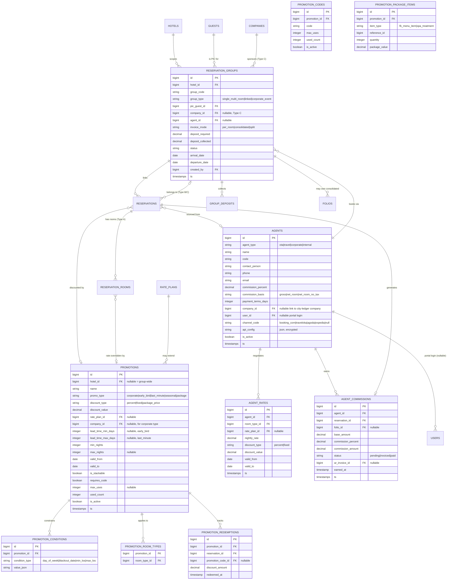

# Group Booking, Promotional Rates & Agent Booking — Implementation Plan

> Status: Proposal (not yet implemented). Companion to `docs/plan.md` — this document follows the same conventions (Actions/Services architecture, `hotel_id` scoping via `BelongsToHotel`, `decimal(14,2)` money columns, PHP 8.1+ backed enums stored as varchar, `snake_case` plural tables) and should be merged into `docs/plan.md` / `docs/todo.md` once scoped and approved.

## 0. Current-State Summary (read from codebase)

The reservation/billing core already exists and this plan builds strictly on top of it — no breaking changes to existing tables are proposed, only additive columns/tables.

| Concern | Existing building block |
|---|---|
| Reservation header + rooms | `reservations` (1) ← `reservation_rooms` (N) — already supports **multiple rooms per reservation** (Type A groundwork exists) via `App\Actions\Reservations\CreateReservationAction` |
| Availability / overlap guard | `App\Services\AvailabilityService` — **all** booking paths must route through this (`CRITICAL Business Rule #1`) |
| Rates | `rate_plans` (`App\Models\RatePlan`, `RatePlanType`: standard/weekend/seasonal/promo/corporate) + `seasons` — promo/corporate rate *types* exist as enum values but there is **no CRUD, no condition engine, no auto-apply, no promo codes** |
| Billing | `folios` ← `folio_items`, `App\Services\FolioPostingService`, `App\Services\TaxCalculator`, `App\Services\Accounting\GlPostingService` |
| Corporate / city ledger | `companies` table + `Folio.company_id` + `ArInvoice` + **`ar_invoice_folios` pivot (many-to-many, already exists!)** — this is the exact primitive needed for "invoice per room, per group, or consolidated" (Group Type C) |
| OTA | `App\Http\Controllers\Ota\BookingWebhookController` is a **stub** (`202 Accepted`, comment says "reservation creation not yet implemented") — `routes/api.php` + `StoreOtaBookingRequest` exist but no `Agent`/`Group` concept |
| Reservation source | `ReservationSource` enum: `walkin`, `phone`, `ota`, `telegram`, `web` — no per-source entity (agent, group) to attribute to |
| Activity log / GL | `App\Models\Concerns\LogsActivity` (polymorphic `activity_logs`), `GlPostingService::post()` (balanced double-entry, period-locked) — both must be wired into every new Action |
| Authorization | `spatie/laravel-permission`, permissions seeded in `database/seeders/RolePermissionSeeder.php` as `module.action` strings, checked via `->middleware('can:x.y')` in `routes/web.php` and `$user->can('x.y')` in controllers |
| Frontend | Inertia + React + Ant Design `ProTable` for list pages (`resources/js/Pages/Companies/Index.tsx` pattern: columns + search + pagination, no client search), plain AntD `Form`/`Steps`/`Card` for create/edit pages (`Reservations/Create.tsx`) |

**Gap to close:** no `groups`, `agents`, `promotions` (or richer `rate_plans` conditions), or `promo_codes` tables exist yet. This plan adds them.

---

## 1. Database Schema

### 1.1 ERD



### 1.2 New Tables — Group Booking

**`reservation_groups`** (migration `create_reservation_groups_table`)

| Column | Type | Notes |
|---|---|---|
| `id` | bigint PK | |
| `hotel_id` | `foreignId` → hotels | scoped via `BelongsToHotel` (not nullable — a group is booked at one property) |
| `group_code` | `string(20)` unique | `GRP-YYYYMMDD-0001`, same generator pattern as `Reservation::generateReservationCode()` |
| `group_type` | `string(20)` | enum `GroupType`: `single_multi_room` (Type A), `linked` (Type B), `corporate_event` (Type C) |
| `name` | `string(150)` | e.g. "Acme Corp Annual Offsite" |
| `pic_guest_id` | `foreignId` → guests, nullable | master guest/PIC contact |
| `company_id` | `foreignId` → companies, nullable | Type C negotiated rate / city ledger |
| `agent_id` | `foreignId` → agents, nullable | if sold through an agent |
| `invoice_mode` | `string(20)` | enum `GroupInvoiceMode`: `per_room`, `consolidated`, `split` |
| `arrival_date` / `departure_date` | `date` | denormalized min/max across member reservations, kept in sync by `SyncGroupDatesAction` (or a DB trigger-equivalent observer) for fast calendar queries |
| `deposit_required` | `decimal(14,2)` default 0 | |
| `deposit_collected` | `decimal(14,2)` default 0 | |
| `status` | `string(20)` | enum `GroupStatus`: `draft`, `confirmed`, `partially_checked_in`, `checked_in`, `partially_checked_out`, `checked_out`, `cancelled` |
| `special_requests` | `text` nullable | |
| `created_by` | `foreignId` → users, nullable | |
| `timestamps` | | |

Indexes: `(hotel_id, status)`, `(arrival_date)`, unique `group_code`.

**`reservations` — add columns** (migration `add_group_fields_to_reservations_table`)

| Column | Type | Notes |
|---|---|---|
| `reservation_group_id` | `foreignId` → reservation_groups, nullable | Type A: the *one* reservation IS the group (still nullable-linked for consistent reporting); Type B/C: each linked reservation points here |
| `agent_id` | `foreignId` → agents, nullable | booking source attribution, independent of group |
| `promotion_id` | `foreignId` → promotions, nullable | applied promo at reservation level (see §1.3) |

No changes needed to `reservation_rooms` for Type A (multi-room already supported by the existing 1-to-N `reservations → reservation_rooms` relation) — Type A group booking is really "one `Reservation` + N `ReservationRoom` rows with the same `guest_id`", which the schema already allows. The gap is UI/Action support for **selecting N rooms in one create flow**, not schema.

**`group_deposits`** (optional, or reuse `payments` with a `folio_id` pointing at a new **group deposit folio**). Recommendation: **reuse `folios`/`payments`** rather than a new table — create a `type = 'group_deposit'` folio owned by the group (add `reservation_group_id` nullable FK to `folios`, make `reservation_id` nullable on `folios` to allow group-level folios not tied to one reservation). This avoids a parallel ledger and keeps `FolioPostingService`/`GlPostingService` as the single posting path (Business Rule #2).

- `folios` — add `reservation_group_id` (`foreignId` nullable, FK → reservation_groups), make `reservation_id` nullable (currently `constrained()` not nullable — needs a `change()` migration), add `FolioType::GroupDeposit` and `FolioType::GroupConsolidated` enum cases.
- At checkout, deposit deduction = a `FolioItemType::DepositCredit` (already exists) item posted per member folio, sourced from the group deposit folio balance — implemented in a new `DeductGroupDepositAction`.

### 1.3 New Tables — Promotional Rates

**`promotions`**

| Column | Type | Notes |
|---|---|---|
| `id` | bigint PK | |
| `hotel_id` | `foreignId` nullable | nullable = group-wide promo (mirrors `rate_plans.hotel_id` convention) |
| `name` | `string(150)` | |
| `promo_type` | `string(20)` | enum `PromotionType`: `corporate`, `early_bird`, `last_minute`, `seasonal`, `package` |
| `discount_type` | `string(20)` | enum `DiscountType`: `percent`, `fixed`, `package_price` |
| `discount_value` | `decimal(14,2)` | percent (0–100) or fixed IDR amount or package total price depending on `discount_type` |
| `rate_plan_id` | `foreignId` nullable → rate_plans | optional link — a promo can layer on top of an existing seasonal `rate_plan` instead of the room's `base_rate` |
| `company_id` | `foreignId` nullable → companies | required when `promo_type = corporate` |
| `lead_time_min_days` | `integer` nullable | early_bird: booking must be made ≥ N days before arrival |
| `lead_time_max_days` | `integer` nullable | last_minute: booking must be made ≤ N days before arrival |
| `min_nights` / `max_nights` | `integer` nullable | seasonal / general LOS constraint |
| `valid_from` / `valid_to` | `date` | promo's own availability window (distinct from lead-time, which is relative to *booking date* not stay date) |
| `is_stackable` | `boolean` default false | if false, applying this promo excludes all other promos on the same reservation room |
| `requires_code` | `boolean` default false | if true, only usable via a matching `promotion_codes` row |
| `max_uses` / `used_count` | `integer` nullable/default 0 | global redemption cap |
| `is_active` | `boolean` default true | |
| `timestamps` | | |

**`promotion_room_types`** — pivot, `promotion_id`, `room_type_id` (a promo with no rows = applies to all room types).

**`promotion_conditions`** — generic extensible condition rows instead of hardcoding every rule as a column:

| Column | Type | Notes |
|---|---|---|
| `id` | bigint PK | |
| `promotion_id` | `foreignId` | |
| `condition_type` | `string(30)` | enum `PromotionConditionType`: `day_of_week` (applicable check-in days), `blackout_date`, `min_los`, `max_los` |
| `value` | `json` | e.g. `["mon","tue","wed"]` or `["2026-12-24","2026-12-31"]` |

> This keeps `Condition: applicable_days` from the requirements out of a rigid bitmask column (unlike the legacy `rate_plans.day_of_week_mask` tinyint) so new condition types can be added without a migration.

**`promotion_codes`** — for shareable/generated codes (a promo can have multiple codes, e.g. per-campaign tracking):

| Column | Type | Notes |
|---|---|---|
| `id` | bigint PK | |
| `promotion_id` | `foreignId` | |
| `code` | `string(30)` unique | generated via `Str::upper(Str::random(8))` or human-chosen |
| `max_uses` | `integer` nullable | per-code cap, independent of the promo's global cap |
| `used_count` | `integer` default 0 | |
| `is_active` | `boolean` default true | |
| `expires_at` | `timestamp` nullable | |

**`promotion_redemptions`** — audit trail, one row per applied promo (mirrors `general_ledger.source_type/source_id` pattern for traceability):

| Column | Type | Notes |
|---|---|---|
| `id` | bigint PK | |
| `promotion_id` | `foreignId` | |
| `promotion_code_id` | `foreignId` nullable | |
| `reservation_id` | `foreignId` | |
| `reservation_room_id` | `foreignId` nullable | if applied at the room-night level |
| `discount_amount` | `decimal(14,2)` | actual IDR amount discounted, for reporting (promo P&L impact) |
| `redeemed_at` | `timestamp` | |

**`promotion_package_items`** — for `promo_type = package` (room + F&B/Spa bundle):

| Column | Type | Notes |
|---|---|---|
| `id` | bigint PK | |
| `promotion_id` | `foreignId` | |
| `item_type` | `string(20)` | enum: `fb_menu_item`, `spa_treatment` |
| `reference_id` | `bigint` | polymorphic-by-convention FK into `menu_items.id` or `spa_treatments.id` (kept as plain FK + type flag rather than `morphs()` since only 2 types exist and both already have dedicated tables — consistent with `folio_items.reference_type/reference_id` pattern used elsewhere) |
| `quantity` | `integer` default 1 | |
| `package_value` | `decimal(14,2)` | the item's "menu price" used only for the itemized package breakdown shown on the folio/invoice, not separately charged |

**`reservation_rooms` — add column**: `promotion_id` (`foreignId` nullable → promotions) so the discount is attributable per room-night, since `nightly_rate` already stores the *effective* (post-discount) rate.

### 1.4 New Tables — Agent Booking

**`agents`**

| Column | Type | Notes |
|---|---|---|
| `id` | bigint PK | |
| `agent_type` | `string(20)` | enum `AgentType`: `ota`, `travel`, `corporate`, `internal` |
| `name` | `string(150)` | |
| `code` | `string(30)` unique | short code, e.g. `BCOM`, `TVLK`, `AGD`, or internal sales rep code |
| `channel_code` | `string(30)` nullable | for `agent_type = ota`: `booking_com`, `traveloka`, `agoda`, `expedia` — drives channel-manager webhook routing (extends the existing `Ota\BookingWebhookController`) |
| `contact_person` | `string(150)` nullable | |
| `phone` / `email` | nullable | |
| `commission_percent` | `decimal(5,2)` default 0 | |
| `commission_basis` | `string(20)` | enum `CommissionBasis`: `gross` (room + tax + SC), `net_room` (room charge only, pre-tax), `net_room_no_tax` — configurable, mirrors the `tax_rules.is_compounding` "don't hardcode the formula" pattern already used by `TaxCalculator` |
| `payment_terms_days` | `integer` default 30 | for commission AR |
| `company_id` | `foreignId` nullable → companies | link a corporate/travel agent to a city-ledger `companies` row for consolidated AR invoicing, reusing the existing `ArInvoice`/`ar_invoice_folios` mechanism instead of inventing a parallel agent-invoice table |
| `user_id` | `foreignId` nullable → users | agent portal login (see §4) |
| `api_config` | `text` nullable, cast `encrypted:array` | OTA API credentials if a future push-based sync is added (Phase 2+; this plan only implements inbound webhook, matching the existing stub) |
| `is_active` | `boolean` default true | |
| `timestamps` | | |

**`agent_rates`** (agent-specific negotiated rates — distinct from `promotions.promo_type = corporate` because an agent rate is keyed by room type + validity window, not by discount-on-base-rate; an agent can also simply reference a `rate_plan_id`):

| Column | Type | Notes |
|---|---|---|
| `id` | bigint PK | |
| `agent_id` | `foreignId` | |
| `room_type_id` | `foreignId` | |
| `rate_plan_id` | `foreignId` nullable → rate_plans | if set, this row is just a validity wrapper around an existing rate plan |
| `nightly_rate` | `decimal(14,2)` nullable | flat negotiated net rate, used when `rate_plan_id` is null |
| `discount_type` / `discount_value` | nullable | alternative to flat rate — percent/fixed off `room_types.base_rate` |
| `valid_from` / `valid_to` | `date` | |
| `is_active` | `boolean` default true | |

**`agent_commissions`** — one row per reservation the agent sourced (created at check-in or at folio close, configurable):

| Column | Type | Notes |
|---|---|---|
| `id` | bigint PK | |
| `agent_id` | `foreignId` | |
| `reservation_id` | `foreignId` | |
| `folio_id` | `foreignId` nullable | the folio the base_amount was computed from |
| `base_amount` | `decimal(14,2)` | per `commission_basis` |
| `commission_percent` | `decimal(5,2)` | snapshot at time of calc (agent's rate may change later) |
| `commission_amount` | `decimal(14,2)` | |
| `status` | `string(20)` | enum `AgentCommissionStatus`: `pending`, `invoiced`, `paid` |
| `ar_invoice_id` | `foreignId` nullable → ar_invoices | when settled via AR (internal/corporate agents), OR |
| `deduction_folio_item_id` | `foreignId` nullable → folio_items | when settled as a direct deduction against what the hotel remits to the OTA (net-rate OTA model) |
| `earned_at` | `timestamp` | |
| `timestamps` | | |

**`reservations` — already covered above** (`agent_id`, reused from §1.2).

### 1.5 GL / Chart of Accounts additions

Per `ChartOfAccountsSeeder`, add (per-hotel, following the `4-xxxx`/`6-xxxx`/`2-xxxx` numbering convention in `docs/plan.md` §2.12):
- `6-1400` **Beban Komisi Agen** (Agent Commission Expense) — debited when commission accrues.
- `2-1400` **Utang Komisi Agen** (Agent Commission Payable) — credited on accrual, debited when paid via `SupplierInvoice`-style settlement or bank payment.
- `4-1900` **Diskon Promosi** (Promotional Discount, contra-revenue) — debited for the discount amount so gross room revenue and discounts are visible separately in the income statement (do **not** just reduce `nightly_rate` silently — post the gross rate then a contra-discount line, matching how `tax`/`service_charge` are separate `FolioItem` rows today).

---

## 2. Service / Action Layer

Following the existing `App\Actions\{Domain}\*Action` (single business operation) + `App\Services\*Service` (cross-cutting/query logic) split:

### 2.1 New Services

- **`App\Services\PromotionEngine`** — the "auto-apply logic" core.
  - `findApplicable(RoomType $roomType, Carbon $checkin, Carbon $checkout, ?Company $company, ?string $code): Collection<Promotion>` — evaluates lead-time, min/max nights, day-of-week, blackout dates, room-type scoping, company scoping, and code validity.
  - `resolveBestRate(RoomType $roomType, RatePlan $baseRatePlan, array $applicablePromotions): array{nightly_rate, promotion_id, discount_amount}` — for non-stackable promos, picks the single best (largest discount) one; for stackable, applies in sequence and records each in `promotion_redemptions`.
  - `redeem(Promotion $promotion, Reservation $reservation, ?ReservationRoom $room, ?PromotionCode $code, float $discountAmount): void` — increments `used_count` (row-locked) and writes `promotion_redemptions`.
  - Reused by: `CreateReservationAction` (web + Telegram both call this, per the "never duplicate business logic" rule), `Ota\BookingWebhookController` once implemented, and a new `PromotionQuoteController` for the "suggest promo" UI (live quote endpoint before submitting the reservation).

- **`App\Services\AgentCommissionService`**
  - `calculateForReservation(Reservation $reservation, Agent $agent): array{base_amount, commission_amount}` — reads `commission_basis` off the agent, sums the relevant `folio_items`.
  - `accrue(Reservation $reservation, Agent $agent, ?User $performedBy): AgentCommission` — creates the `agent_commissions` row + posts the GL accrual (`6-1400` debit / `2-1400` credit) via `GlPostingService`, wrapped in `DB::transaction`. Called from `CheckOutGuestAction` (or check-in, per hotel policy — make it configurable via a `hotels.commission_accrual_trigger` column or a simple constant to start).
  - `generateStatement(Agent $agent, Carbon $from, Carbon $to): array` — for the commission report (§5).

- **`App\Services\GroupBookingService`**
  - `getMemberReservations(ReservationGroup $group): Collection<Reservation>`
  - `getConsolidatedBalance(ReservationGroup $group): float` — sums `FolioPostingService::getBalance()` across all member folios, or the single consolidated folio if `invoice_mode = consolidated`.
  - `syncGroupDates(ReservationGroup $group): void` — recomputes `arrival_date`/`departure_date` from member reservations (called after any member add/remove/date-change).

### 2.2 New Actions

| Action | Responsibility |
|---|---|
| `App\Actions\Groups\CreateGroupAction` | Creates `reservation_groups` row; for Type A, creates one `Reservation` + N `ReservationRoom` in a single call (extends `CreateReservationAction` logic for multi-room — see §2.3); for Type B/C, just creates the group shell, members added separately |
| `App\Actions\Groups\AddReservationToGroupAction` | Links an existing (or newly created) `Reservation` to a group; re-validates via `AvailabilityService` as normal; calls `GroupBookingService::syncGroupDates()` |
| `App\Actions\Groups\RemoveReservationFromGroupAction` | Unlinks; blocked if reservation is checked in (must check out or cancel first) |
| `App\Actions\Groups\GroupCheckInAction` | Wraps `CheckInGuestAction` in a loop across all member reservations inside one `DB::transaction`; partial-failure policy: **all-or-nothing** is too strict for real front-desk ops (a blacklisted guest in a 20-room group shouldn't block the other 19) — so this collects per-reservation results and returns a summary `{succeeded: [], failed: [{reservation_id, reason}]}`, updating `reservation_groups.status` to `partially_checked_in` or `checked_in` accordingly |
| `App\Actions\Groups\GroupCheckOutAction` | Same pattern, wrapping `CheckOutGuestAction` per room; on full completion, triggers deposit deduction/refund via `DeductGroupDepositAction` |
| `App\Actions\Groups\CollectGroupDepositAction` | Creates/reuses the group's deposit folio, posts a `Payment` against it via `FolioPostingService::postPayment()` |
| `App\Actions\Groups\DeductGroupDepositAction` | At group checkout: computes remaining deposit balance, allocates it across member folios (pro-rata or PIC's choice), posts `FolioItemType::DepositCredit` items |
| `App\Actions\Groups\GenerateGroupInvoiceAction` | Reads `invoice_mode`: `per_room` → one PDF per member folio (reuse existing `InvoiceController`); `consolidated` → merges all member folio items into a single `ArInvoice` + `ar_invoice_folios` rows (reuses existing pivot!) and renders one PDF; `split` → user manually selects which folios go into which invoice, same underlying pivot mechanism |
| `App\Actions\Agents\CreateAgentAction`, `UpdateAgentAction` | Standard CRUD, thin — likely can just be controller `->create()`/`->update()` like `CompanyController` does today; only extracted to an Action if commission-basis validation grows complex |
| `App\Actions\Agents\AccrueCommissionAction` | Thin wrapper delegating to `AgentCommissionService::accrue()`, invoked from `CheckOutGuestAction` (extend it, see §2.3) or a scheduled command for batch accrual |

### 2.3 Required Changes to Existing Code

- **`CreateReservationAction`**: add optional `room_selections: array<{room_type_id, room_id?, rate_plan_id?}>` input to support **Type A multi-room in one call** (currently hardcoded to one `room_type_id`/`room_id` pair — see `app/Actions/Reservations/CreateReservationAction.php:46-120`). Add optional `agent_id`, `promotion_code` params; when present, call `PromotionEngine::resolveBestRate()` before computing `nightly_rate` (replacing the direct `resolveNightlyRate()` call at line 173).
- **`CheckOutGuestAction`**: after closing the folio, if `reservation.agent_id` is set, call `AgentCommissionService::accrue()` (`app/Actions/Reservations/CheckOutGuestAction.php:86-89`, right after `closeFolio`).
- **`FolioPostingService::findOrCreateMasterFolio`**: accept an optional `agentId`/`promotionId` for line-item metadata; no structural change needed since `folio_items.reference_type/reference_id` already generically supports pointing at any model (`Promotion`, `AgentCommission`) for the discount/commission line items.
- **`Ota\BookingWebhookController`**: implement the stub — resolve `Agent` by `channel_code` matching `channel` field in the payload, resolve `RoomType` by `room_type_code`, then call `CreateReservationAction` with `source: 'ota'`, `created_via: 'ota_webhook'`, `agent_id`. This finally closes the "reservation creation not yet implemented" TODO.
- **`ReservationSource` enum**: no change needed — `ota`/`web`/`telegram` already cover the booking channel; `agent_id` is a separate, orthogonal attribution (an agent booking can arrive via `phone` + `agent_id` set, e.g. a travel agent calling in).
- **`RolePermissionSeeder`**: add permissions — `groups.view`, `groups.manage`, `groups.checkin`, `groups.checkout`, `promotions.view`, `promotions.manage`, `agents.view`, `agents.manage`, `agents.portal` (agent's own restricted access, see §4).

---

## 3. Routes

All under the existing `auth` + `hotel.context` middleware group in `routes/web.php`, following the `->middleware('can:x.y')` convention:

### 3.1 Groups

```
GET    /groups                              groups.index            can:groups.view
GET    /groups/create                       groups.create            can:groups.manage
POST   /groups                              groups.store              can:groups.manage
GET    /groups/{group}                      groups.show               can:groups.view
GET    /groups/{group}/edit                 groups.edit               can:groups.manage
PUT    /groups/{group}                      groups.update             can:groups.manage
POST   /groups/{group}/reservations          groups.reservations.add   can:groups.manage   (Type B/C: link existing/new reservation)
DELETE /groups/{group}/reservations/{res}    groups.reservations.remove can:groups.manage
POST   /groups/{group}/checkin              groups.checkin            can:groups.checkin
POST   /groups/{group}/checkout             groups.checkout           can:groups.checkout
POST   /groups/{group}/deposit              groups.deposit.store      can:groups.manage
GET    /groups/{group}/invoice              groups.invoice            can:billing.invoice   (query param ?mode=per_room|consolidated|split)
POST   /groups/{group}/invoice/generate     groups.invoice.generate   can:billing.invoice
```

### 3.2 Promotions

```
GET    /admin/promotions                    admin.promotions.index    can:promotions.view
POST   /admin/promotions                    admin.promotions.store    can:promotions.manage
PUT    /admin/promotions/{promotion}        admin.promotions.update   can:promotions.manage
DELETE /admin/promotions/{promotion}        admin.promotions.destroy  can:promotions.manage
POST   /admin/promotions/{promotion}/codes  admin.promotions.codes.store   can:promotions.manage   (generate a shareable code)
DELETE /admin/promotions/codes/{code}       admin.promotions.codes.destroy can:promotions.manage

POST   /reservations/quote                  reservations.quote        can:reservations.create
```
`reservations.quote` is a new lightweight endpoint (`PromotionQuoteController@store`) called live from the booking form (arrival/departure/room type/promo code as input) returning applicable promos + computed nightly rate, powering the "auto-apply / suggest promo" requirement without submitting a full reservation.

### 3.3 Agents

```
GET    /admin/agents                        admin.agents.index        can:agents.view
POST   /admin/agents                        admin.agents.store        can:agents.manage
PUT    /admin/agents/{agent}                admin.agents.update       can:agents.manage
DELETE /admin/agents/{agent}                admin.agents.destroy      can:agents.manage
GET    /admin/agents/{agent}/rates          admin.agents.rates.index  can:agents.manage
POST   /admin/agents/{agent}/rates          admin.agents.rates.store  can:agents.manage
PUT    /admin/agents/rates/{rate}           admin.agents.rates.update can:agents.manage

GET    /reports/agent-commissions           reports.agent-commissions can:reports.view
GET    /reports/agent-commissions/export    reports.agent-commissions.export can:reports.view
```

### 3.4 Agent Portal (separate limited-access area, see §4)

```
GET    /agent-portal/login                  agent.login
POST   /agent-portal/login                  agent.login.store
GET    /agent-portal/dashboard              agent.dashboard           auth:agent
GET    /agent-portal/reservations           agent.reservations.index  auth:agent
GET    /agent-portal/reservations/create    agent.reservations.create auth:agent
POST   /agent-portal/reservations           agent.reservations.store  auth:agent
GET    /agent-portal/commissions            agent.commissions.index   auth:agent
```

### 3.5 OTA Webhook (extend existing, in `routes/api.php`)

```
POST   /api/ota/bookings                    (existing route, controller logic implemented per §2.3)
POST   /api/ota/bookings/{external_booking_id}/cancel   (new — handle OTA-initiated cancellations)
```

---

## 4. Agent Portal — Access Model

Recommendation: **do not** create a fully parallel auth guard/table unless OTA self-service is required — for internal/travel/corporate agents, the simplest approach consistent with existing conventions is:

- `agents.user_id` → a real `users` row with a new role `agent` in `RolePermissionSeeder` (permissions: `agent_portal.access`, scoped to **their own bookings only** via a policy, not a blanket `reservations.*`).
- A dedicated thin layout (`AgentPortalLayout`) and route prefix (`/agent-portal`) reusing the same `auth` guard + a `EnsureUserIsAgent` middleware that also binds `$request->agent` (the linked `Agent` model) for controllers to scope queries (`Reservation::where('agent_id', $request->agent->id)`).
- This mirrors how `TelegramUser` links to `users` for permission delegation (`docs/plan.md` §2.2) — reuse the pattern rather than inventing OAuth/API-token agent auth for v1. OTA agents (Booking.com etc.) never need portal login — they only ever hit the webhook.

---

## 5. Frontend Pages (Inertia + React + AntD ProTable)

Following the `ProTable` list-page pattern (`resources/js/Pages/Companies/Index.tsx`) and AntD `Form`/`Steps` create pattern (`resources/js/Pages/Reservations/Create.tsx`):

### 5.1 Groups (`resources/js/Pages/Groups/`)
- `Index.tsx` — ProTable: group_code, name, type, PIC guest, #rooms, status tag, arrival/departure, deposit balance. Filter by status/type/date range (mirrors `Reservations/Index.tsx` filter bar).
- `Create.tsx` — `Steps`: (1) Group info (name, type, PIC guest picker reusing existing guest-search component from `Reservations/Create.tsx`, company/agent optional) → (2) Type A: room grid multi-select (extend the existing availability grid component in `Reservations/components/`); Type B/C: skip to (3) → (3) Deposit (optional initial collection).
- `Show.tsx` — Group header card (status, deposit balance, invoice mode) + a table of member reservations (reuse `Reservations/Index.tsx` row rendering) each with inline check-in/check-out action buttons + a "Check In All" / "Check Out All" primary action that calls the Group actions and shows a per-room success/failure summary (toast list, since `GroupCheckInAction` returns partial results).
- `components/RoomMultiSelect.tsx` — new shared component: grid of available rooms per room-type with quantity steppers, used by both `Groups/Create.tsx` (Type A) and possibly a future "quick multi-room booking" shortcut off `Reservations/Create.tsx`.

### 5.2 Promotions (`resources/js/Pages/Admin/Promotions/`)
- `Index.tsx` — ProTable: name, type tag, discount summary ("15% off" / "Rp 200,000 off" / "Package: Rp 1,500,000"), valid_from–valid_to, used/max, active toggle. Inline "Generate Code" action opening a modal listing existing codes with copy-to-clipboard.
- Create/Edit as a `Drawer` form (matches `Admin/RatePlans` pattern likely used already — confirm against `Admin/RatePlans/Index.tsx` before implementing) with conditional fields shown per `promo_type` (e.g. lead-time fields only for early_bird/last_minute, company picker only for corporate, package item picker only for package).
- `PackageItemsPicker.tsx` — searchable multi-select over `menu_items` + `spa_treatments` for package promos.

### 5.3 Reservation booking flow enhancement
- `Reservations/Create.tsx` — add a "Promo code" input + live-quote call to `POST /reservations/quote` (debounced) that displays applicable/suggested promos as selectable chips before submit, and an "Agent" picker (searchable select, optional) for phone/travel-agent bookings.

### 5.4 Agents (`resources/js/Pages/Admin/Agents/`)
- `Index.tsx` — ProTable: name, type tag, channel (for OTA), commission %, commission basis, active toggle, link to rates/commissions.
- `Show.tsx` — Tabs: Details (edit form), Rates (`AgentRates` mini-ProTable, CRUD inline), Commissions (recent `agent_commissions` with status tags).
- `resources/js/Pages/Reports/AgentCommissions.tsx` — ProTable + summary cards (total pending, total invoiced, total paid), date range filter, Excel export button (matches existing `Reports/*` export button convention).

### 5.5 Agent Portal (`resources/js/Pages/AgentPortal/`)
- Minimal, separate layout: `Dashboard.tsx` (upcoming bookings, commission summary), `Reservations/Create.tsx` (a restricted subset of the main booking form — no rate override, forced `agent_id` = self, uses the agent's own `agent_rates`), `Commissions/Index.tsx` (read-only statement).

---

## 6. Business-Rule / Cross-Cutting Compliance Checklist

Per the workspace's `CRITICAL Business Rules`, every new Action must:

1. **Room overlap** — `CreateGroupAction`/`AddReservationToGroupAction` must call `AvailabilityService::lockOverlappingForHotel()` + `assertRoomAvailable()`/`getAvailableRooms()` exactly as `CreateReservationAction` does today — never a raw `ReservationRoom::create()`.
2. **Double-entry** — `AgentCommissionService::accrue()` and the promo contra-revenue posting both go through `GlPostingService::post()` with balanced debit/credit arrays inside `DB::transaction`.
3. **Period locking** — inherited automatically since all postings route through `GlPostingService`, which already calls `resolveOpenPeriod()` and rejects closed periods.
4. **Telegram parity** — if/when group booking or promo-code entry is exposed via Telegram (future phase), it must call `GroupBookingService`/`PromotionEngine`/`CreateReservationAction`, never duplicate logic in `app/Telegram/`.
5. **Tax order** — promo discounts are applied to the *pre-tax* room amount (reduce `nightly_rate`/post a contra-revenue line) before `FolioPostingService::postCharge()` computes tax via `TaxCalculator`, so PPN/SC always compute on the net (post-discount) amount — matches current behavior since `nightly_rate` already flows straight into `postCharge()`.

---

## 7. Testing Plan (Pest/PHPUnit, mirrors existing `tests/Feature/*Test.php` structure)

- `GroupBookingTest.php` — create Type A/B/C group happy paths; group check-in with one blacklisted guest (partial success); group check-out with deposit deduction; invoice generation in all 3 `invoice_mode`s.
- `PromotionEngineTest.php` — data-provider style (per `.cursor/rules` "high-risk areas need heavy data-provider tests"): lead-time boundary (exactly N days), stackable vs exclusive, blackout dates, code max-uses exhaustion, expired code, wrong room type.
- `AgentCommissionTest.php` — commission calc for each `commission_basis`, GL balance assertion (`SUM(debit) === SUM(credit)`), accrual idempotency (checkout twice should not double-post — mirrors `GlPostingService::isAlreadyPosted()` dedup already in place).
- `OtaWebhookBookingTest.php` — extend existing `OtaWebhookTest.php`: full booking creation (not just the 202 stub), duplicate `external_booking_id` handling, unknown `channel_code` rejection.
- `AgentPortalAuthorizationTest.php` — agent can only see their own reservations/commissions (403 on others'), mirrors `FbAuthorizationTest.php`/`AccountingAuthorizationTest.php` pattern already in the suite.
- Frontend: smoke test group create wizard and promo Drawer form render without console errors (per testing guidance: "Frontend: smoke tests on ProTable pages, prioritize backend coverage").

---

## 8. Effort Estimate

Assuming one senior full-stack dev familiar with this codebase, in ideal days (not calendar days):

| Feature | Migrations & Models | Services/Actions | Controllers/Routes | Frontend | Tests | **Subtotal** |
|---|---|---|---|---|---|---|
| Promotional Rates (all 4 types + codes + engine) | 1.5 | 3 (PromotionEngine is the hard part — condition evaluation + stacking) | 1.5 | 3 (Admin CRUD + quote UI in booking flow) | 2 | **11** |
| Group Booking Type A (multi-room single reservation) | 0.5 (mostly UI/Action, schema mostly exists) | 1.5 | 1 | 2.5 | 1.5 | **7** |
| Group Booking Type B (linked reservations) | 1 | 2 | 1.5 | 2 | 1.5 | **8** |
| Group Booking Type C (corporate/event, split/consolidated invoicing) | 0.5 (reuses `ar_invoice_folios`) | 2.5 (invoice-mode branching is the hard part) | 1 | 2 | 1.5 | **7.5** |
| Group check-in/out + deposit management | included above | 2 (partial-success semantics) | 0.5 | 1.5 | 1.5 | **5.5** |
| Agent CRUD + agent-specific rates | 1 | 1 | 1 | 2 | 1 | **6** |
| Agent commission calc + reporting | included above | 2 | 1 | 2 (report page) | 1.5 | **6.5** |
| Agent portal (internal/travel/corporate) | 0.5 (role + middleware) | 1 | 1.5 | 3 | 1.5 | **7.5** |
| OTA webhook completion (booking.com/traveloka/agoda/expedia inbound) | — | 1.5 | 1 | — | 1.5 | **4** |
| GL/CoA additions + integration wiring | 0.5 | 1 (touch points in existing Actions) | — | — | 1 | **2.5** |
| **Total** | **~5.5** | **~17.5** | **~10** | **~18** | **~14** | **≈ 65 ideal-dev-days (~13 weeks solo, ~7 weeks with 2 devs in parallel on backend/frontend)** |

Suggested delivery order (each phase independently shippable and testable):
1. **Promotions** first (no dependency on Group/Agent, immediately usable by existing single-room bookings).
2. **Group Type A** (schema mostly exists — fastest win, validates the multi-room UI pattern reused by B/C).
3. **Agents CRUD + commission** (no dependency on Group).
4. **Group Type B & C** (depends on Agent for `agents.company_id` linkage and Promotion for corporate-rate overlap decisions).
5. **Agent portal + OTA webhook completion** last — highest external-integration risk, benefits from the rest being stable.

---

## 9. Open Questions for Stakeholder Sign-off (mirrors `docs/plan.md` §11.1 style)

1. **Commission accrual trigger** — at check-in, at check-out, or at folio close/invoice? (Affects cash-basis vs accrual-basis timing and AR aging.) Recommendation: accrue at check-out (matches when `total_spend`/`GuestStay` is finalized).
2. **Promo + Agent-rate interaction** — can a travel agent's `agent_rates` row be *further* discounted by a stackable promo, or are agent rates always final/non-stackable? Recommendation: agent rates are terminal (no promo stacking) to avoid double-discount edge cases in v1; revisit if commercially needed.
3. **Group deposit refund** — if a group cancels before arrival, is the deposit refundable, forfeited, or partial per a cancellation policy? Needs a `group_cancellation_policies` concept or manual finance approval — out of scope for v1, flagged here.
4. **OTA channel manager** — is this plan's "inbound webhook per OTA" sufficient, or is a two-way channel manager (rate/availability push to OTAs) required? This plan only covers inbound (matches the existing stub's scope); two-way sync is a materially larger integration (per-OTA API contracts) and should be a separate plan if needed.
