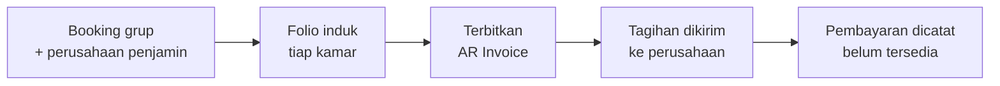
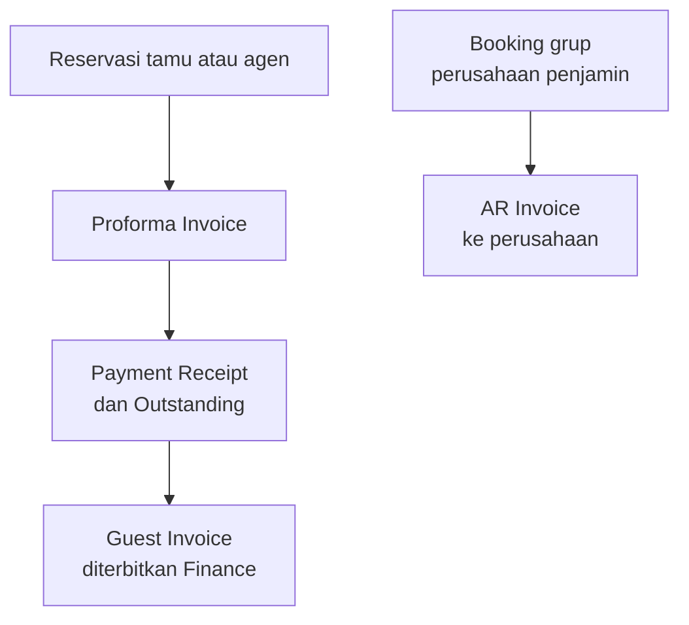

# Fitur AR Invoice (Piutang Usaha) dan Integrasinya dengan Folio Tamu

**Pratasaba ERP · 24 September 2026**

## 1. Ringkasan

**AR Invoice** adalah tagihan yang diterbitkan atas nama **perusahaan penjamin**, bukan atas nama tamu perorangan. Fitur ini dipakai ketika satu perusahaan menanggung biaya menginap beberapa tamu sekaligus — misalnya perusahaan travel, agen, atau instansi yang mengirim rombongan dan membayar seluruh tagihan secara kolektif setelah rombongan selesai.

Di aplikasi, menu ini berada di **Accounting → AR Invoices**. Dua halaman tersedia:

**Daftar tagihan**

| Kolom | Isi |
|---|---|
| Nomor | Nomor tagihan, format `AR-tanggal-urutan` |
| Perusahaan | Nama perusahaan yang ditagih |
| Periode | Tanggal awal sampai tanggal akhir tagihan |
| Total | Nilai tagihan yang diterbitkan |
| Dibayar | Nilai yang sudah tercatat dibayar |
| Sisa | Selisih total dikurangi dibayar |
| Status | Open, Partially Paid, Paid, Overdue, atau Void |
| Jatuh Tempo | Batas waktu pembayaran |
| Aksi | Tombol View untuk membuka rinciannya |

**Rincian tagihan** menampilkan informasi pokok tagihan ditambah **daftar folio yang ditagihkan** — nomor folio, nama tamu, dan saldo folio saat halaman dibuka.

## 2. Bagaimana satu AR Invoice terbentuk

AR Invoice selalu lahir dari **booking grup**: satu booking yang menampung beberapa reservasi kamar di bawah satu nama perusahaan.

Langkahnya di aplikasi:

1. Buka halaman **Groups**, pilih grup yang dimaksud.
2. Pastikan grup sudah terhubung ke perusahaan penjamin dan pilihan cara penagihannya sudah benar.
3. Klik tombol **Generate Invoice**.
4. Sistem membuat AR Invoice beserta nomornya, lalu menautkan folio-folio grup ke tagihan tersebut.
5. Tagihan dapat dibuka kembali kapan saja dari menu **Accounting → AR Invoices**.

Cara penagihan grup ada tiga pilihan:

| Cara penagihan | Isi tagihan | Cocok dipakai untuk |
|---|---|---|
| Per Room | Satu tagihan untuk setiap kamar | Perusahaan yang ingin rincian per kamar |
| Consolidated | Satu tagihan untuk seluruh kamar grup | Perusahaan yang ingin satu tagihan gabungan |
| Split | Satu tagihan dari kamar yang dipilih saja | Sebagian kamar ditagihkan ke perusahaan, sisanya dibayar sendiri |

Nomor tagihan mengikuti pola `AR-tanggal-urutan`, misalnya **AR-20260924-0001**. Masa berlaku tagihan diambil dari tanggal kedatangan sampai tanggal keberangkatan grup, **jatuh tempo 30 hari** setelah penerbitan, dan status awalnya **Open**.

## 3. Bagaimana hubungannya dengan folio tamu

Bagian ini yang perlu dipahami betul karena AR Invoice **tidak menagih semua folio**:

1. **Hanya folio induk dari reservasi anggota grup yang ditagihkan.** Folio tamu lain — misalnya folio pribadi atau folio tambahan — tidak ikut masuk ke tagihan perusahaan.
2. **Nilai tagihan diambil pada saat penerbitan.** Sistem menghitung total tagihan dari folio-folio grup pada detik tombol Generate Invoice ditekan, lalu menyimpannya sebagai nilai tagihan. Tagihan bersifat catatan tetap: perubahan yang terjadi pada folio sesudahnya **tidak** otomatis mengubah nilai tagihan yang sudah terbit.
3. **Daftar folio tetap terlihat di rincian tagihan**, lengkap dengan saldo folio yang sedang berjalan. Saldo ini dibaca langsung dari folio, sehingga bisa berbeda dari nilai total tagihan bila folio sudah berubah setelah tagihan terbit.
4. **Nomor AR dan nomor dokumen tamu berdiri sendiri.** AR Invoice memakai seri `AR-...`, sedangkan Proforma Invoice, Payment Receipt, dan Guest Invoice memakai seri masing-masing.
5. **Satu folio bisa ikut di beberapa tagihan.** Sistem belum menandai folio yang sudah pernah diterbitkan tagihannya, jadi tombol Generate Invoice pada grup yang sama dapat menghasilkan tagihan baru untuk folio yang sama. Untuk saat ini, penerbitan perlu dilakukan sekali saja per grup.

## 4. Dua jalur dokumen di aplikasi

Aplikasi ini memiliki dua jalur dokumen yang berbeda tujuan:

| Pembanding | Jalur tamu / agen | Jalur korporat (AR Invoice) |
|---|---|---|
| Sumber | Satu reservasi | Booking grup (beberapa reservasi) |
| Pihak yang ditagih | Tamu atau agen | Perusahaan penjamin |
| Urutan dokumen | Proforma → Payment Receipt → Guest Invoice | Langsung satu tagihan AR |
| Dipakai oleh | Marketing dan Finance | Accounting, untuk penagihan kolektif |
| Tujuan | Tagihan per reservasi | Tagihan per perusahaan |

## 5. Yang sudah tersedia dan yang belum

Supaya tidak ada salah paham saat fitur ini dipakai, berikut keadaan fitur pada tanggal dokumen ini.

| Bagian | Status | Keterangan |
|---|---|---|
| Membuat tagihan korporat dari booking grup | Tersedia | Tiga cara penagihan: Per Room, Consolidated, Split |
| Daftar dan rincian tagihan | Tersedia | Termasuk daftar folio dan saldo folio |
| Mencatat pembayaran tagihan | Belum tersedia | Nilai dibayar masih nol, status belum berpindah dari Open |
| Cetak atau unduh tagihan (PDF) | Belum tersedia | Tagihan baru dapat dilihat di layar |
| Jurnal otomatis untuk piutang | Belum tersedia | Tagihan korporat belum otomatis masuk ke jurnal keuangan |
| Penanda folio sudah ditagihkan | Belum tersedia | Penerbitan perlu dilakukan sekali saja per grup |

Tiga hal pertama pada tabel di atas adalah usulan pengembangan lanjutan yang bisa kami kerjakan setelah ada keputusan dari tim: **pencatatan pembayaran**, **cetak tagihan dalam bentuk PDF**, dan **jurnal otomatis piutang** agar angkanya sejalan dengan laporan keuangan.

## 6. Yang kami minta dari tim

1. Apakah pola **booking grup dengan perusahaan penjamin** ini memang akan dipakai di Pratasaba? Selama ini tagihan ke perusahaan lebih sering ditangani lewat jalur tamu/agen (Proforma Invoice sampai Guest Invoice).
2. Mohon dikirimkan **daftar perusahaan** yang akan ditagih beserta cara penagihan yang biasa dipakai (per kamar atau gabungan).
3. Mohon dikirimkan **contoh format AR Invoice** yang biasa dipakai tim — seperti contoh Proforma Invoice dan Payment Receipt yang sebelumnya sudah kami jadikan acuan — supaya bentuk cetakannya dapat kami sesuaikan.
4. Berapa **jangka waktu jatuh tempo** yang biasa diberikan kepada perusahaan? Sistem saat ini memakai 30 hari.
5. Apakah tagihan perusahaan perlu **otomatis masuk jurnal keuangan**, atau cukup sampai dokumen tagihannya?
6. Siapa yang berwenang **menerbitkan** tagihan korporat dan mencatat pelunasannya?

## 7. Status data di sistem saat ini

Pada tanggal dokumen ini, di sistem **belum ada** tagihan AR maupun booking grup yang tercatat, sehingga fitur ini belum berisi data nyata. Data perusahaan yang ada saat ini masih berupa data contoh. Karena itu, bila pola penagihan korporat akan dijalankan, kami perlu menyiapkan data perusahaannya lebih dulu bersama tim Accounting.

## Catatan penutup

Dokumen ini menjelaskan fitur seperti yang benar-benar ada di aplikasi pada tanggal di atas, termasuk bagian yang belum tersedia. Bila ada pertanyaan atau penyesuaian yang diperlukan, silakan menghubungi kami.
