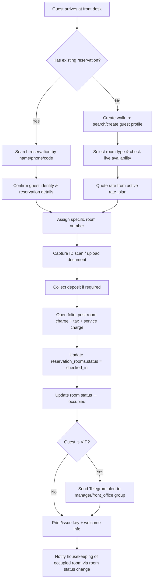
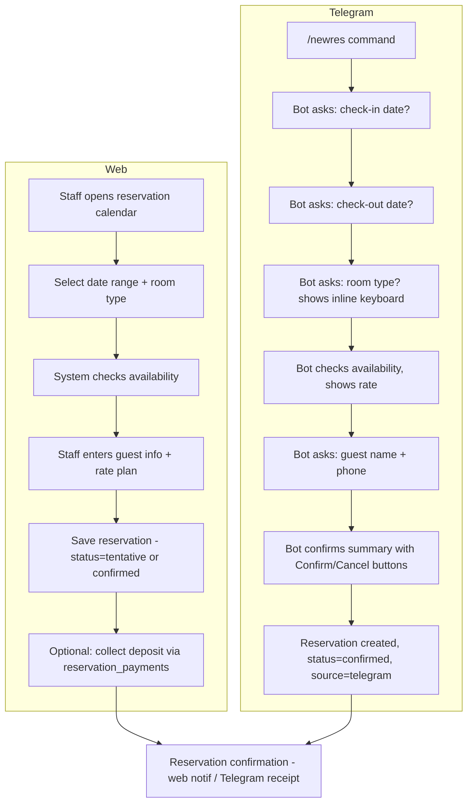
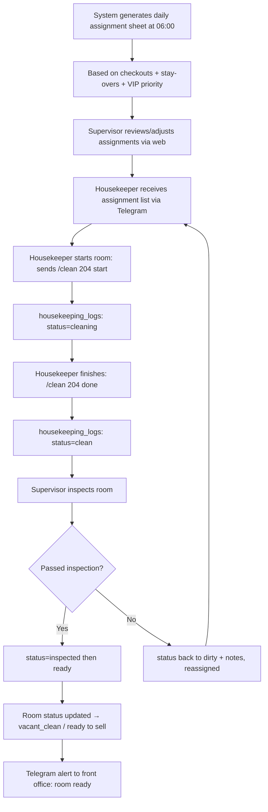
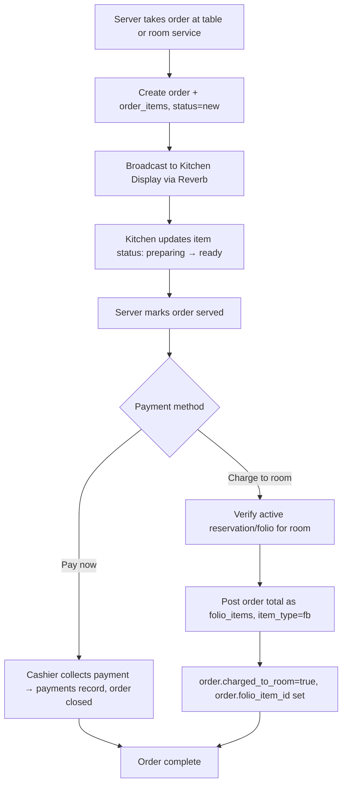
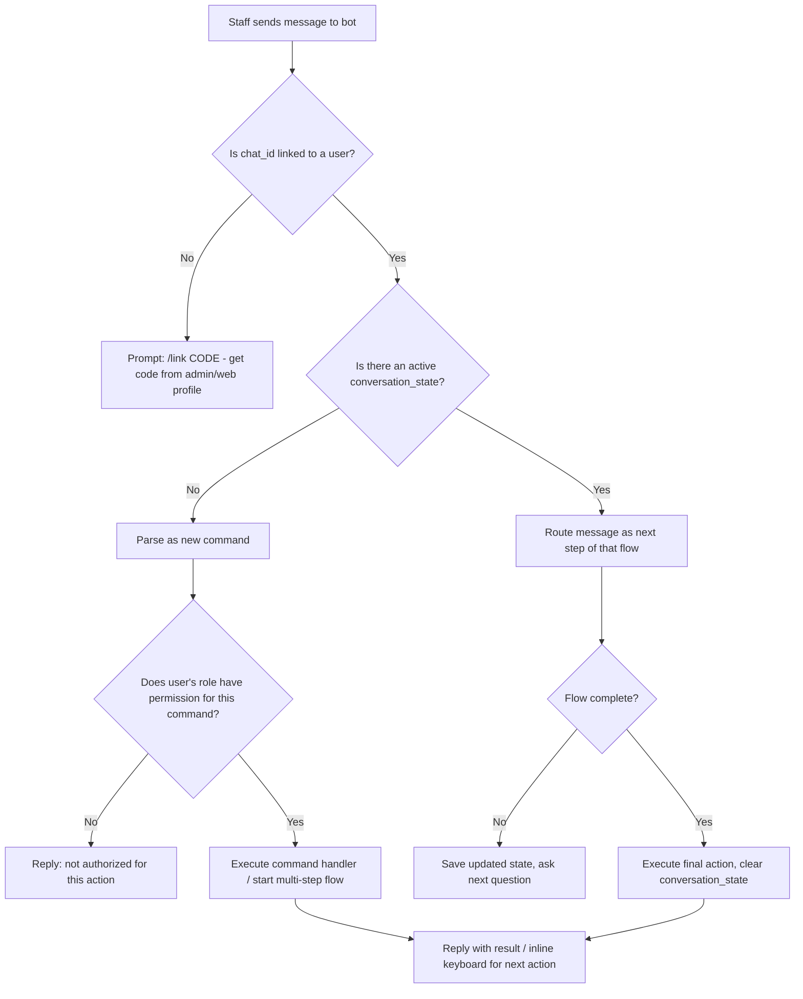
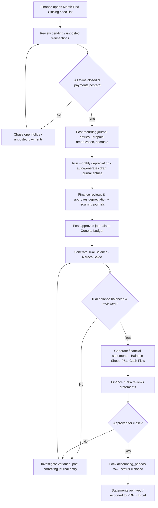

# Hotel & Resort ERP — Implementation Plan

> **Status:** Draft v1.1 — Greenfield project plan
> **Stack:** Laravel 13+ (PHP 8.5) · Inertia.js + React + Ant Design ProTable · MySQL 8 · Laravel Reverb · `irazasyed/telegram-bot-sdk` · Laravel Queue (database driver) · DomPDF · `maatwebsite/excel`
> **Context:** Indonesian hospitality operations (PPN 11%, Service Charge 10% common practice), single-property MVP with multi-property-ready architecture. Full **accrual-based, double-entry accounting** (PSAK-aligned) is a first-class module, not an afterthought — this plan is reviewed against CPA/finance-grade standards.

---

## Table of Contents

1. [Executive Summary](#1-executive-summary)
2. [Core Modules](#2-core-modules-feature-list)
3. [ERD (Entity Relationship Diagram)](#3-erd-entity-relationship-diagram)
4. [Schema Design (Per Module)](#4-schema-design-per-module)
5. [UX Flow](#5-ux-flow)
6. [Telegram Bot Specification](#6-telegram-bot-specification)
7. [Routes (API & Web)](#7-routes-api--web)
8. [Frontend Component Tree](#8-frontend-component-tree)
9. [Implementation Phases](#9-implementation-phases)
10. [Conventions & Architecture](#10-conventions--architecture)
11. [Open Questions & Decisions](#11-open-questions--decisions)

---

## 1. Executive Summary

### What this ERP does

A full-featured **Hotel & Resort Enterprise Resource Planning (ERP)** system that unifies front office operations, housekeeping, food & beverage (F&B), billing/finance, guest relationship management (CRM), inventory/purchasing, maintenance/engineering, spa & wellness, **full accounting & finance (General Ledger, financial statements, AR/AP, budgeting, tax)**, and management reporting into a single web application — with a **Telegram bot as a first-class operational channel** for staff who are on the move (housekeepers, front office agents, maintenance techs, F&B runners, duty managers).

The system replaces disconnected spreadsheets, WhatsApp coordination, and paper logbooks with:
- A single source of truth for room inventory, reservations, and guest folios.
- Role-based web dashboards (Ant Design ProTable-driven) for desk-bound staff (front office, finance, management).
- A Telegram bot for floor staff who need fast, low-friction access without opening a laptop — check room status, update housekeeping status, receive alerts, and even process check-in/out from a phone.
- Finance-grade billing: folios, tax (PPN 11%), service charge (10%), split billing, city ledger for corporate accounts — reflecting proper accrual accounting discipline expected by a CPA-led finance team.
- A dedicated **Accounting Module** ([2.12](#212-accounting--finance-new--must-have)) sitting underneath every revenue/expense-generating module: a Chart of Accounts, double-entry General Ledger, Journal Entries, PSAK-aligned financial statements (Neraca, Laba Rugi, Arus Kas), AR/AP subledgers, bank reconciliation, fixed assets/depreciation, budgeting, and Indonesian tax accounting (PPN, PPh 21/23/4(2)) — every folio charge, payment, supplier invoice, and stock movement posts to the GL automatically, so the books are always current, not reconstructed at month-end.

### Target users

| User group | Primary interface | Core needs |
|---|---|---|
| **Front Office / Reservation** | Web (ProTable, calendar) + Telegram | Reservations, check-in/out, room status, rate quoting |
| **Housekeeping** | Telegram (primary) + Web (supervisor view) | Room status updates, task assignment, linen tracking |
| **F&B / Restaurant** | Web (POS-lite) + Telegram (kitchen alerts) | Orders, charge-to-room, kitchen display |
| **Management / GM** | Web dashboard + Telegram alerts | Occupancy, revenue, ADR/RevPAR, exception alerts (VIP, incidents) |
| **Finance / Accounting (CPA)** | Web (ProTable, reports) + Telegram (quick GL/report queries) | Chart of Accounts, General Ledger, journal entries, financial statements (Neraca/Laba Rugi/Arus Kas), AR/AP, bank reconciliation, fixed assets, budgeting, tax reconciliation (PPN/PPh), exports |
| **Maintenance / Engineering** | Telegram (work orders) + Web (asset registry) | Work orders, preventive maintenance, asset tracking |
| **Spa & Wellness staff** | Web (booking calendar) + Telegram (schedule) | Appointments, therapist schedule, charge-to-room |
| **Guests** (indirect, MVP placeholder) | Online booking widget (future), front desk | Reservation, stay, checkout |

### Key differentiator: Telegram bot for staff operations

Unlike generic hotel PMS software, this ERP treats **Telegram as a full operational surface**, not just a notification channel:

- Each staff `User` links to a `telegram_users` record via a one-time linking code (`/link CODE`).
- Role-based command permissions — a housekeeper cannot create reservations via Telegram; a front office agent cannot approve purchase requisitions.
- Two-way: staff *receive* alerts (VIP arrival, room ready, maintenance emergency) and *act* (check availability, update room status, check-in/out, approve requests) directly from chat, backed by Laravel's queue + Reverb broadcasting for near real-time push.
- Conversational, stateful flows (multi-step) implemented via a lightweight conversation-state table (`telegram_conversation_states`), not just single-shot commands.

---

## 2. Core Modules (Feature List)

### 2.1 Front Office / Reservation (MUST HAVE)

- Room reservation calendar — timeline/Gantt-style view (custom React component using `dayjs` grid + Ant Design `Table`/`Card`, since AntD does not ship a native Gantt; evaluate `@ant-design/plots` or a dedicated grid) with drag-to-create, drag-to-extend, drag-to-move between rooms.
- Walk-in check-in (no prior reservation) — quick form: guest lookup/create, room type/rate selection, instant folio creation.
- Online booking integration **placeholder** — inbound webhook endpoint (`/api/ota/bookings`) stubbed for future Booking.com/Traveloka/Agoda channel manager integration; normalizes into internal `reservations`.
- Room status dashboard — grid of all rooms colored by status: `vacant_clean`, `vacant_dirty`, `occupied_clean`, `occupied_dirty`, `out_of_order`, `out_of_service`, `reserved`.
- Guest check-in / check-out flow — full flow incl. deposit collection, ID capture, room key assignment (logical, not physical lock integration in MVP).
- ID scanning / guest registration — file upload (photo of KTP/Passport) + manual data entry; OCR is **out of scope for MVP**, flagged as future enhancement.
- Room transfer / upgrade — mid-stay room change with folio rate adjustment and housekeeping notification.
- Group / corporate booking — one reservation header with N `reservation_rooms`, optional link to a `companies` (city ledger) account.
- Rate management — seasonal, weekend, promo rates via `rate_plans` + `seasons` + date-based rate overrides.

### 2.2 Telegram Bot for Staff (MUST HAVE)

- Check room availability via Telegram (`/rooms`, `/available`).
- Create/modify reservations via Telegram (`/newres`, `/editres`) — front office role only.
- Check-in/check-out guests via Telegram (`/checkin`, `/checkout`).
- Staff alerts: VIP check-in, room ready, maintenance issues, low stock, pending approvals.
- Full command list with syntax/examples — see [Section 6](#6-telegram-bot-specification).
- Multi-user linking — each `users` row can link exactly one `telegram_users.chat_id`; unlinking/re-linking supported by admin.

### 2.3 Housekeeping

- Room assignment to housekeepers (daily assignment sheet, by floor/zone).
- Room status update: `dirty` → `cleaning` → `clean` → `inspected` → `ready`.
- Linen & amenities inventory per floor (par stock tracked in `inventory_items` scoped by `floors`/`locations`).
- Maintenance request logging (housekeeper can raise a `maintenance_requests` ticket directly from a dirty/broken room).
- Daily housekeeping schedule — auto-generated from checkout list + stay-over list + VIP priority flag.

### 2.4 Food & Beverage / Restaurant

- Menu management (categories, items, modifiers, pricing, availability toggle).
- Table / room service ordering — `orders` linked to either a `restaurant_tables` or a `reservations` (room service).
- POS integration (basic) — in-house lightweight POS screen; **not** a full POS replacement, just order capture + payment.
- Charge to room — posts an `order` total as a `folio_items` line on the guest's active folio.
- Kitchen display / order tracking — Kanban-style (`new` → `preparing` → `ready` → `served`) via Reverb broadcast to a kitchen-display React view.

### 2.5 Billing & Front Desk Cashier

- Folio management (guest bill) — one or more folios per reservation/stay (e.g., master + incidental).
- Multiple payment methods — cash, debit/credit card, bank transfer, e-wallet (QRIS), city ledger.
- Deposit handling — deposit collected at check-in, tracked as a folio credit, reconciled at checkout.
- Tax & service charge — configurable, defaults to **PPN 11%** + **Service Charge 10%**, applied per line item or per folio per tax rules.
- Invoice printing (PDF) — DomPDF-rendered invoice/receipt.
- Split billing — split one folio's items across multiple payers (e.g., roommates) or split one item across payment methods.
- City ledger (corporate accounts) — `companies` accounts with AR terms, invoiced periodically, tracked as receivables (not settled at checkout).

### 2.6 Guest Management (CRM)

- Guest profile with stay history (aggregated `guest_stays`).
- Preferences & special requests (`guest_preferences` — pillow type, floor preference, dietary notes).
- VIP flagging (`guests.vip_tier`: none/silver/gold/platinum) — triggers Telegram alerts to front office/management.
- Blacklist / incident tracking (`guest_incidents` — damage, no-show, misconduct) with `guests.is_blacklisted` flag.
- Email/SMS marketing **placeholder** — `marketing_campaigns` table stub, actual sending integration out of scope for MVP.

### 2.7 Inventory & Purchasing

- Stock management — amenities, linens, F&B ingredients (`inventory_items`, categorized, per-location).
- Purchase requisition & approval — `purchase_requisitions` → `purchase_orders` with role-based approval workflow.
- Supplier management (`suppliers`).
- Stock-in / stock-out (`stock_movements` — type: `in`, `out`, `adjustment`, `transfer`).
- Low stock alerts — threshold-based, pushed via Telegram to purchasing/finance role.

### 2.8 Reporting & Analytics

- Daily revenue report (room + F&B + spa + other, by payment method and by department).
- Occupancy report (occupancy %, rooms sold, rooms available, by room type).
- ADR (Average Daily Rate) & RevPAR (Revenue per Available Room).
- F&B sales report (by category, by item, by shift).
- Housekeeping efficiency (avg. clean time, rooms per housekeeper, inspection pass rate).
- Export to Excel/PDF (via `maatwebsite/excel` for Excel, DomPDF for PDF).

### 2.9 Administration

- User management — roles: `admin`, `front_office`, `housekeeping`, `fb` (F&B), `manager`, `finance`, `maintenance`, `spa`.
- Room type & room setup (`room_types`, `rooms`, `floors`).
- Rate plan configuration (`rate_plans`, `seasons`, `promotions`).
- Tax configuration (`tax_rules` — PPN, service charge, configurable %, applicability).
- Hotel profile settings (`hotel_settings` — name, address, logo, currency, timezone, check-in/out default times).

### 2.10 Maintenance / Engineering

- Work order system (`maintenance_requests` → `work_orders`).
- Preventive maintenance schedule (`preventive_maintenance_schedules` recurring by interval).
- Asset tracking (`assets` — AC units, water heaters, elevators — with warranty, service history).

### 2.11 Spa & Wellness (Resort-specific)

- Treatment menu (`spa_treatments`).
- Appointment booking (`spa_appointments`).
- Therapist schedule (`spa_therapists`, `spa_therapist_schedules`).
- Charge to room (posts to guest folio, same mechanism as F&B).

### 2.12 Accounting & Finance (NEW — MUST HAVE)

The accounting module is the financial backbone of the ERP — accrual-based, double-entry, PSAK-aligned, and the single source of truth for every rupiah that moves through Front Office, F&B, Spa, and Inventory/Purchasing. Every revenue and expense event elsewhere in the system posts here automatically; nothing bypasses the General Ledger.

**Chart of Accounts (CoA)**
- Standard hotel-industry CoA aligned to PSAK (Pernyataan Standar Akuntansi Keuangan), loosely following the Uniform System of Accounts for the Lodging Industry (USALI) departmental structure, adapted for Indonesian statutory reporting.
- Five account groups: **Aset** (Assets), **Kewajiban** (Liabilities), **Ekuitas** (Equity), **Pendapatan** (Revenue), **Beban** (Expenses) — with Harga Pokok Penjualan (COGS) broken out as its own group for hotel F&B/inventory costing.
- Account numbering convention: `1-0000` Aset, `2-0000` Kewajiban, `3-0000` Ekuitas, `4-0000` Pendapatan, `5-0000` COGS, `6-0000` Beban Operasional — sub-ranges per department (e.g. `4-1000` Room Revenue with `4-1100`/`4-1200`/`4-1300` per room type, `4-2000` F&B Revenue per outlet, `4-3000` Spa Revenue).
- `chart_of_accounts` supports unlimited-depth `parent_id` hierarchy (header/subtotal accounts vs. postable detail accounts), an `account_type` (`asset`,`liability`,`equity`,`revenue`,`cogs`,`expense`), and `normal_balance` (`debit`,`credit`); header accounts are non-postable (`is_postable = false`), enforced at the posting layer.
- Default CoA seeder (`ChartOfAccountsSeeder`) ships ~80–100 hotel-standard accounts out of the box: cash/bank, guest ledger AR, city ledger AR, inventory, prepaid expenses, fixed assets & accumulated depreciation, AP, accrued expenses, tax payable/receivable, room/F&B/spa revenue lines, and standard operating expense lines (payroll, utilities, marketing, admin).
- Custom account creation restricted to the `finance` role; accounts with existing GL history cannot be deleted, only soft-deactivated (`is_active` flag).

**General Ledger**
- Strict double-entry bookkeeping — every transaction is a balanced set of debit/credit lines; the posting layer rejects any unbalanced entry within a DB transaction.
- Every financial-impact event elsewhere in the system posts to the GL automatically and immediately — folio charges, payments received, supplier invoices, stock movements — with no manual re-entry of operational transactions.
- `general_ledger` transaction lines record: account, debit/credit amount, transaction date, reference number, description, `accounting_period_id`, and a polymorphic `source_type`/`source_id`.
- Period locking via `accounting_periods` — once a period is `closed`, no new postings (manual or automatic) may target it; late adjustments require a reversing/correcting entry dated in the current open period.
- Full audit trail: every GL line links back to its originating source document (`folio_items`, `payments`, `supplier_invoices`, `stock_movements`, or a manual `journal_entry_lines` row) — nothing posts to GL without a traceable origin.

**Journal Entries**
- Manual journal entry creation restricted to the `finance` role, for adjustments not covered by automatic posting (accruals, corrections, depreciation, amortization).
- Journal voucher numbering: `JV-{YYYY}{MM}-{seq}` (e.g. `JV-202607-0014`).
- Supporting document upload per journal entry (invoice scan, calculation worksheet, approval memo).
- Recurring journal entries (monthly depreciation, prepaid rent/insurance amortization) auto-generated as `draft` on a schedule for finance to review and approve — never silently auto-posted.
- Approval workflow: `draft` → `submitted` → `approved` → `posted`, mirroring the purchase requisition approval pattern already used in Inventory & Purchasing ([2.7](#27-inventory--purchasing)) for consistency.
- Reversal entries — a posted journal entry can be reversed, generating an equal-and-opposite entry in the current open period rather than mutating history.

**Financial Statements**
- **Neraca (Balance Sheet)** — assets, liabilities, and equity as of a given date, with current/non-current classification.
- **Laba Rugi (Income Statement / P&L)** — revenue, COGS, and operating expenses for a period, with department-level revenue breakdown (rooms/F&B/spa/other) and net income.
- **Arus Kas (Cash Flow Statement)** — operating, investing, and financing activities, built via the indirect method from GL movements on cash/bank plus non-cash adjustments.
- **Trial Balance (Neraca Saldo)** — all account balances pre-adjustment, the reconciliation checkpoint before finalizing statements.
- **General Ledger Report** — per-account transaction history with running balance, drillable to source document.
- All statements/reports filterable by date range, department (rooms/F&B/spa), and property (multi-property-ready, same scoping strategy as [10.6](#106-multi-tenancy-single-hotel-or-multi-property)).
- Export to PDF (DomPDF) and Excel (`maatwebsite/excel`), matching the export conventions already used in Reporting & Analytics ([2.8](#28-reporting--analytics)).
- Comparative periods built into every statement view: this month vs. last month, and YTD vs. last year YTD.

**Accounts Receivable (AR) — City Ledger Extension**
- Formalizes the city ledger concept already introduced in Billing ([2.5](#25-billing--front-desk-cashier), [4.5](#45-billing--folio)) into a proper AR subledger — `ar_invoices` are generated periodically from open city-ledger folios per `companies` account, rather than folios simply staying open indefinitely.
- AR aging report — 0-30, 31-60, 61-90, 90+ day buckets by company.
- Customer statements (PDF) for corporate accounts, summarizing open invoices for a period.
- Payment allocation — incoming AR payments applied against specific `ar_invoices` (oldest-first default, manually overridable).
- Credit limit enforcement at folio posting — `companies.credit_limit` checked before a new city-ledger charge is allowed to post; over-limit charges require manager override.
- Dunning letters / reminders — **placeholder** (template + manual trigger only; automated scheduling out of scope for MVP).

**Accounts Payable (AP)**
- Supplier invoice entry (`supplier_invoices` + `supplier_invoice_lines`) matched against `purchase_orders`/`purchase_order_items` (3-way match: PO → goods receipt → invoice).
- AP aging report — same bucket structure as AR aging, by supplier.
- Payment scheduling — due-date-driven payment run list, prioritized by `suppliers` payment terms.
- Tax withholding on supplier payments — **PPh 23** (services/rentals, 2%) and **PPh 4(2)** (final tax on land/building rent) calculated automatically per supplier invoice line based on a tax-object classification.
- Bukti Potong (withholding tax slip) — **placeholder** (data captured; PDF slip generation stubbed for future e-Bupot integration).

**Bank Reconciliation**
- Bank account setup (`bank_accounts`) — supports multiple accounts (operational, payroll, deposit accounts), each mapped to a GL cash/bank account.
- Import bank statement via CSV upload (staged into `bank_reconciliation_lines` before matching).
- Matching engine pairs GL cash/bank lines against imported statement lines (amount + date-window auto-match, manual match for the remainder).
- Outstanding checks / deposits-in-transit tracked as unmatched lines carried forward to the next reconciliation period.
- Reconciliation report — book balance vs. statement balance, itemized reconciling items, signed off by finance.

**Fixed Assets & Depreciation**
- Asset register (`fixed_assets`) ties into the Maintenance module's existing `assets` table ([4.8](#48-maintenance--engineering)) rather than duplicating it — a `fixed_assets` row references the physical `asset` and carries the accounting attributes (acquisition cost, useful life, salvage value).
- Depreciation methods: straight-line and double-declining balance, selectable per asset.
- Monthly depreciation run auto-generates a recurring journal entry (draft, pending finance approval) debiting the relevant depreciation expense account and crediting accumulated depreciation.
- Asset disposal / write-off — posts remaining net book value as gain/loss on disposal.
- Asset revaluation — supported with a dedicated revaluation journal entry type and audit note (reason, appraised value, approver).

**Budgeting**
- Annual budget per department — rooms, F&B, spa, admin, maintenance, marketing.
- Budget per account (`budget_lines`) — both revenue and expense accounts, with a monthly breakdown for the fiscal year.
- Budget vs. Actual report with variance analysis (amount and %), drillable by department and by month.
- Budget input form — spreadsheet-like monthly entry grid (AntD editable `Table`) per account, with copy-from-last-year and % escalation helpers.

**Tax Accounting**
- **PPN (VAT) Input & Output** tracking — output tax from guest folios (already charged per [4.5](#45-billing--folio)), input tax from supplier invoices; both flow into `tax_transactions` for reconciliation.
- PPN monthly reconciliation — output vs. input tax summary to support SPT Masa PPN preparation (manual filing in MVP; no direct e-Faktur API integration — see [Open Questions](#11-open-questions--decisions)).
- **PPh 21** (employee income tax) — **placeholder**, awaiting the Payroll module scope decision ([Open Questions](#11-open-questions--decisions)); schema reserves a `pph21` tax type.
- **PPh 23** (service/rental withholding, 2%) on qualifying supplier payments — see Accounts Payable above.
- **PPh 4(2)** (final tax on rent/land) where applicable — see Accounts Payable above.
- **PBB** (property tax) — **placeholder** (annual expense entry only, no calculation engine).
- Tax report generation — per-tax-type summary for a period, exportable for the CPA/finance team's external filing workflow.

**Integration Points with Existing Modules**
- Folio charges → auto-post to GL: debit AR/Guest Ledger (or Cash if paid immediately), credit the relevant Revenue account, per [4.5](#45-billing--folio).
- Payments received → auto-post to GL: debit Cash/Bank, credit AR/Guest Ledger.
- Supplier/purchase invoices → auto-post to GL: debit Expense or Inventory, credit AP, per [4.9](#49-inventory--purchasing).
- Stock movements (consumption) → auto-post COGS to GL: debit COGS, credit Inventory asset account.
- Payroll (future module) → auto-post salary expense journal entries once Payroll scope is decided.
- Telegram bot commands: `/gl {account_code}`, `/trialbalance`, `/pnl {month}`, `/balancesheet` — see [6.3](#63-full-command-list).

---

## 3. ERD (Entity Relationship Diagram)

> Full-system logical ERD. Some low-cardinality lookup tables (e.g., `permissions` pivot) are simplified for readability; full column lists are in [Section 4](#4-schema-design-per-module).

```mermaid
erDiagram
    USERS ||--o| TELEGRAM_USERS : "links to"
    USERS }o--o{ ROLES : "has (role_user)"
    ROLES }o--o{ PERMISSIONS : "has (permission_role)"
    USERS ||--o{ HOUSEKEEPING_ASSIGNMENTS : "assigned as housekeeper"
    USERS ||--o{ RESERVATIONS : "created_by"
    USERS ||--o{ FOLIO_ITEMS : "posted_by"
    USERS ||--o{ MAINTENANCE_REQUESTS : "reported_by / assigned_to"

    ROOM_TYPES ||--o{ ROOMS : "categorizes"
    FLOORS ||--o{ ROOMS : "contains"
    ROOMS ||--o{ RESERVATION_ROOMS : "booked in"
    ROOMS ||--o{ HOUSEKEEPING_LOGS : "has status logs"
    ROOMS ||--o{ MAINTENANCE_REQUESTS : "has issues"

    GUESTS ||--o{ GUEST_PREFERENCES : "has"
    GUESTS ||--o{ GUEST_STAYS : "has history"
    GUESTS ||--o{ GUEST_INCIDENTS : "has incidents"
    GUESTS ||--o{ RESERVATIONS : "books"
    COMPANIES ||--o{ RESERVATIONS : "sponsors (corporate)"

    RESERVATIONS ||--o{ RESERVATION_ROOMS : "contains"
    RESERVATIONS ||--o{ RESERVATION_PAYMENTS : "has deposits"
    RESERVATIONS ||--o{ FOLIOS : "generates"
    RESERVATION_ROOMS }o--|| ROOMS : "for room"
    RESERVATION_ROOMS }o--|| RATE_PLANS : "priced by"

    FOLIOS ||--o{ FOLIO_ITEMS : "line items"
    FOLIOS ||--o{ PAYMENTS : "settled by"
    FOLIOS }o--o| COMPANIES : "billed to (city ledger)"

    HOUSEKEEPING_ASSIGNMENTS ||--o{ HOUSEKEEPING_LOGS : "produces"
    ROOMS ||--o{ HOUSEKEEPING_ASSIGNMENTS : "assigned"

    MAINTENANCE_REQUESTS ||--o| WORK_ORDERS : "escalates to"
    ASSETS ||--o{ WORK_ORDERS : "serviced by"
    ASSETS ||--o{ PREVENTIVE_MAINTENANCE_SCHEDULES : "scheduled"

    MENU_ITEMS }o--o{ ORDERS : "ordered (order_items)"
    ORDERS ||--o{ ORDER_ITEMS : "contains"
    ORDERS }o--o| RESTAURANT_TABLES : "served at"
    ORDERS }o--o| RESERVATIONS : "room service for"
    ORDERS ||--o| FOLIO_ITEMS : "charged to room"

    SUPPLIERS ||--o{ PURCHASE_ORDERS : "fulfills"
    INVENTORY_ITEMS ||--o{ STOCK_MOVEMENTS : "tracked by"
    PURCHASE_REQUISITIONS ||--o{ PURCHASE_ORDERS : "converted to"
    PURCHASE_ORDERS ||--o{ PURCHASE_ORDER_ITEMS : "contains"
    STOCK_MOVEMENTS }o--|| INVENTORY_ITEMS : "moves"

    RATE_PLANS }o--|| SEASONS : "applies during"
    RATE_PLANS ||--o{ PROMOTIONS : "discounted by"

    SPA_TREATMENTS ||--o{ SPA_APPOINTMENTS : "booked as"
    SPA_THERAPISTS ||--o{ SPA_APPOINTMENTS : "performs"
    SPA_APPOINTMENTS }o--o| RESERVATIONS : "charge to room"

    TELEGRAM_USERS ||--o{ TELEGRAM_CONVERSATION_STATES : "has active flow"

    CHART_OF_ACCOUNTS ||--o{ CHART_OF_ACCOUNTS : "parent of (sub-accounts)"
    CHART_OF_ACCOUNTS ||--o{ GENERAL_LEDGER : "posted to"
    ACCOUNTING_PERIODS ||--o{ GENERAL_LEDGER : "contains postings"
    USERS ||--o{ JOURNAL_ENTRIES : "created_by / approved_by"
    JOURNAL_ENTRIES ||--o{ JOURNAL_ENTRY_LINES : "contains"
    JOURNAL_ENTRY_LINES }o--|| CHART_OF_ACCOUNTS : "debits/credits"
    JOURNAL_ENTRIES ||--o{ GENERAL_LEDGER : "posts as"

    FOLIO_ITEMS ||--o| GENERAL_LEDGER : "auto-posts (source)"
    PAYMENTS ||--o| GENERAL_LEDGER : "auto-posts (source)"
    STOCK_MOVEMENTS ||--o| GENERAL_LEDGER : "auto-posts COGS (source)"

    SUPPLIERS ||--o{ SUPPLIER_INVOICES : "bills"
    PURCHASE_ORDERS ||--o{ SUPPLIER_INVOICES : "matched against"
    SUPPLIER_INVOICES ||--o{ SUPPLIER_INVOICE_LINES : "contains"
    SUPPLIER_INVOICES ||--o| GENERAL_LEDGER : "auto-posts (source)"

    COMPANIES ||--o{ AR_INVOICES : "billed (city ledger)"
    AR_INVOICES }o--o{ FOLIOS : "consolidates"
    AR_INVOICES ||--o{ PAYMENTS : "settled by"

    BANK_ACCOUNTS ||--o{ BANK_RECONCILIATIONS : "reconciled periodically"
    BANK_RECONCILIATIONS ||--o{ BANK_RECONCILIATION_LINES : "contains"
    BANK_RECONCILIATION_LINES }o--o| GENERAL_LEDGER : "matches"

    BUDGETS ||--o{ BUDGET_LINES : "contains"
    BUDGET_LINES }o--|| CHART_OF_ACCOUNTS : "budgets"

    ASSETS ||--o| FIXED_ASSETS : "accounting record"
    FIXED_ASSETS ||--o{ GENERAL_LEDGER : "depreciation auto-posts"

    TAX_TRANSACTIONS }o--|| CHART_OF_ACCOUNTS : "affects tax account"
    FOLIO_ITEMS ||--o| TAX_TRANSACTIONS : "output tax"
    SUPPLIER_INVOICE_LINES ||--o| TAX_TRANSACTIONS : "input tax"
```



---

## 4. Schema Design (Per Module)

> Convention: all tables use `id` (unsigned bigint, PK), `created_at`/`updated_at` (and `deleted_at` where soft-deletes apply). FK columns follow `{singular_table}_id`. Money columns are `decimal(14,2)`. All monetary/tax config assumes **IDR** by default (configurable via `hotel_settings.currency`).

### 4.1 Identity & Access

**`users`**
| Column | Type | Notes |
|---|---|---|
| id | bigint PK | |
| name | varchar(150) | |
| email | varchar(150) unique | |
| password | varchar(255) | |
| employee_id | varchar(50) unique nullable | |
| phone | varchar(30) nullable | |
| is_active | boolean default true | |
| last_login_at | timestamp nullable | |

**`roles`** — `id`, `name` (unique, e.g. `admin`, `front_office`, `housekeeping`, `fb`, `manager`, `finance`, `maintenance`, `spa`), `label`, `description`.

**`role_user`** (pivot) — `role_id` FK, `user_id` FK, composite unique(`role_id`,`user_id`).

**`permissions`** — `id`, `name` (unique, e.g. `reservations.create`), `label`, `module`.

**`permission_role`** (pivot) — `permission_id` FK, `role_id` FK.

> Index: `role_user(user_id)`, `permission_role(role_id)`. Business logic: prefer Laravel Gate/Policy backed by these two pivots; consider `spatie/laravel-permission` as an accelerant (see [Open Questions](#11-open-questions--decisions)).

**`telegram_users`**
| Column | Type | Notes |
|---|---|---|
| id | bigint PK | |
| user_id | bigint FK → users, unique, nullable | null until linked |
| chat_id | bigint unique | Telegram chat id |
| telegram_username | varchar(50) nullable | |
| link_code | varchar(10) nullable | one-time linking code |
| link_code_expires_at | timestamp nullable | |
| linked_at | timestamp nullable | |
| is_active | boolean default true | staff can be disabled without unlinking |

**`telegram_conversation_states`**
| Column | Type | Notes |
|---|---|---|
| id | bigint PK | |
| telegram_user_id | bigint FK | |
| flow | varchar(50) | e.g. `new_reservation`, `checkin`, `maintenance_ticket` |
| step | varchar(50) | current step key |
| payload | json | accumulated answers |
| expires_at | timestamp | auto-expire stale flows |

Index: `telegram_conversation_states(telegram_user_id)`.

### 4.2 Front Office / Rooms

**`floors`** — `id`, `hotel_id` (nullable FK for future multi-property), `name`, `level` (int, for sort).

**`room_types`**
| Column | Type | Notes |
|---|---|---|
| id | bigint PK | |
| name | varchar(100) | e.g. "Deluxe", "Suite", "Villa" |
| code | varchar(20) unique | |
| max_occupancy | smallint | |
| base_rate | decimal(14,2) | default rate before rate plan overrides |
| description | text nullable | |
| amenities | json nullable | list of amenity codes |

**`rooms`**
| Column | Type | Notes |
|---|---|---|
| id | bigint PK | |
| room_type_id | bigint FK | |
| floor_id | bigint FK | |
| number | varchar(10) unique | e.g. "204" |
| status | enum | `vacant_clean`,`vacant_dirty`,`occupied_clean`,`occupied_dirty`,`out_of_order`,`out_of_service`,`reserved` |
| notes | text nullable | |

Index: `rooms(room_type_id)`, `rooms(status)`. Business logic: `status` is a **derived cache**, source of truth is the latest `housekeeping_logs` row + active `reservation_rooms`; a model observer/event recalculates it on relevant changes.

**`rate_plans`**
| Column | Type | Notes |
|---|---|---|
| id | bigint PK | |
| room_type_id | bigint FK | |
| season_id | bigint FK nullable | |
| name | varchar(100) | e.g. "Weekend Rate", "Promo Merdeka" |
| rate_type | enum | `standard`,`weekend`,`seasonal`,`promo`,`corporate` |
| nightly_rate | decimal(14,2) | |
| day_of_week_mask | tinyint nullable | bitmask Mon..Sun for weekend rates |
| valid_from | date nullable | |
| valid_to | date nullable | |
| is_active | boolean default true | |

**`seasons`** — `id`, `name` (e.g. "High Season - Lebaran"), `start_date`, `end_date`.

**`promotions`** — `id`, `rate_plan_id` FK nullable, `code` unique, `discount_type` (`percent`|`fixed`), `discount_value`, `valid_from`, `valid_to`, `max_uses`, `used_count`.

### 4.3 Guests / CRM

**`guests`**
| Column | Type | Notes |
|---|---|---|
| id | bigint PK | |
| full_name | varchar(150) | |
| id_number | varchar(50) nullable | KTP/Passport |
| id_type | enum(`ktp`,`passport`,`sim`,`other`) | |
| id_document_path | varchar(255) nullable | uploaded scan |
| phone | varchar(30) nullable | |
| email | varchar(150) nullable | |
| address | text nullable | |
| nationality | varchar(60) nullable | |
| vip_tier | enum(`none`,`silver`,`gold`,`platinum`) default `none` | |
| is_blacklisted | boolean default false | |
| blacklist_reason | text nullable | |

Index: `guests(id_number)`, `guests(phone)`, `guests(vip_tier)`.

**`guest_preferences`** — `id`, `guest_id` FK, `key` (e.g. `pillow_type`), `value`, `notes`.

**`guest_stays`** (denormalized history, populated on checkout) — `id`, `guest_id` FK, `reservation_id` FK, `room_id` FK, `check_in_at`, `check_out_at`, `nights`, `total_spend` decimal(14,2).

**`guest_incidents`** — `id`, `guest_id` FK, `reservation_id` FK nullable, `type` (`damage`,`noshow`,`misconduct`,`other`), `description` text, `reported_by` FK users, `occurred_at`.

**`companies`** (corporate / city ledger accounts) — `id`, `name`, `tax_id` (NPWP) nullable, `billing_address`, `credit_limit` decimal(14,2), `payment_terms_days` int default 30, `is_active`.

### 4.4 Reservations

**`reservations`**
| Column | Type | Notes |
|---|---|---|
| id | bigint PK | |
| reservation_code | varchar(20) unique | human-friendly ref, e.g. `RES-20260722-0007` |
| guest_id | bigint FK | primary/booking guest |
| company_id | bigint FK nullable | if corporate booking |
| source | enum(`walkin`,`phone`,`ota`,`telegram`,`web`) | |
| status | enum(`tentative`,`confirmed`,`checked_in`,`checked_out`,`cancelled`,`no_show`) | |
| arrival_date | date | |
| departure_date | date | |
| adults | smallint | |
| children | smallint default 0 | |
| special_requests | text nullable | |
| created_by | bigint FK users nullable | null if OTA/telegram-auto |
| created_via | enum(`web`,`telegram`,`ota_webhook`) | |
| cancelled_reason | text nullable | |

Index: `reservations(status)`, `reservations(arrival_date)`, `reservations(guest_id)`.

**`reservation_rooms`**
| Column | Type | Notes |
|---|---|---|
| id | bigint PK | |
| reservation_id | bigint FK | |
| room_id | bigint FK nullable | null until room-assigned (unassigned block booking) |
| room_type_id | bigint FK | for rate-shopping before assignment |
| rate_plan_id | bigint FK nullable | |
| nightly_rate | decimal(14,2) | snapshot at booking time |
| check_in_at | timestamp nullable | actual |
| check_out_at | timestamp nullable | actual |
| status | enum(`booked`,`checked_in`,`checked_out`,`no_show`,`cancelled`) | |

Index: `reservation_rooms(room_id, check_in_at)` for overlap queries; unique constraint via app-level overlap validation (DB triggers optional, see notes).

> **Business logic note:** overlap prevention (no double-booking a room) enforced at application/service layer with a DB transaction + `SELECT ... FOR UPDATE` on the date range, since MySQL lacks native range-exclusion constraints.

**`reservation_payments`** (deposits/advance payments prior to folio settlement) — `id`, `reservation_id` FK, `amount` decimal(14,2), `method` (`cash`,`card`,`transfer`,`ewallet`), `paid_at`, `received_by` FK users, `reference_no` nullable.

### 4.5 Billing / Folio

**`folios`**
| Column | Type | Notes |
|---|---|---|
| id | bigint PK | |
| folio_no | varchar(20) unique | e.g. `FOL-20260722-0012` |
| reservation_id | bigint FK | |
| guest_id | bigint FK | |
| company_id | bigint FK nullable | if billed to city ledger |
| type | enum(`master`,`incidental`) default `master` | supports split-by-folio |
| status | enum(`open`,`closed`,`voided`) | |
| opened_at | timestamp | |
| closed_at | timestamp nullable | |

**`folio_items`**
| Column | Type | Notes |
|---|---|---|
| id | bigint PK | |
| folio_id | bigint FK | |
| item_type | enum(`room`,`fb`,`spa`,`misc`,`tax`,`service_charge`,`discount`,`deposit_credit`) | |
| description | varchar(255) | |
| reference_type | varchar(60) nullable | polymorphic: `order`,`spa_appointment`,`reservation_room` |
| reference_id | bigint nullable | polymorphic id |
| quantity | decimal(10,2) default 1 | |
| unit_price | decimal(14,2) | |
| amount | decimal(14,2) | qty × unit_price, pre-tax |
| tax_amount | decimal(14,2) default 0 | |
| service_charge_amount | decimal(14,2) default 0 | |
| posted_by | bigint FK users nullable | |
| posted_at | timestamp | |

Index: `folio_items(folio_id)`, `folio_items(reference_type, reference_id)`.

**`payments`**
| Column | Type | Notes |
|---|---|---|
| id | bigint PK | |
| folio_id | bigint FK | |
| amount | decimal(14,2) | |
| method | enum(`cash`,`card`,`transfer`,`ewallet_qris`,`city_ledger`) | |
| reference_no | varchar(100) nullable | card auth code / transfer ref |
| received_by | bigint FK users | |
| paid_at | timestamp | |
| is_refund | boolean default false | |

**`tax_rules`** — `id`, `name` (e.g. "PPN"), `code` (`ppn`,`service_charge`), `rate_percent` decimal(5,2) (e.g. `11.00`, `10.00`), `applies_to` (`room`,`fb`,`spa`,`all`), `is_compounding` boolean (service charge base before or after PPN — configurable), `is_active`.

> **Indonesian tax note:** Standard practice = Service Charge 10% applied first on gross, then PPN 11% applied on (gross + service charge). `tax_rules.is_compounding` + calculation order encoded in a `TaxCalculator` service class, not hardcoded, so rates/order are admin-configurable per [Section 10](#10-conventions--architecture).

### 4.6 Housekeeping

**`housekeeping_assignments`** — `id`, `room_id` FK, `housekeeper_id` FK users, `assignment_date` date, `shift` (`morning`,`afternoon`,`night`), `status` (`pending`,`in_progress`,`done`,`skipped`), `assigned_by` FK users.

**`housekeeping_logs`** — `id`, `room_id` FK, `housekeeping_assignment_id` FK nullable, `status` (`dirty`,`cleaning`,`clean`,`inspected`,`ready`,`out_of_order`), `changed_by` FK users, `changed_via` (`web`,`telegram`), `notes` nullable, `changed_at` timestamp.

Index: `housekeeping_logs(room_id, changed_at)`.

**`linen_stock`** — link to `inventory_items` scoped by `floor_id` (see 4.9), not a separate table — reuse inventory module with `location_type = floor`.

### 4.7 F&B / Restaurant

**`menu_categories`** — `id`, `name`, `sort_order`.

**`menu_items`** — `id`, `menu_category_id` FK, `name`, `description`, `price` decimal(14,2), `is_available` boolean, `image_path` nullable, `sku` nullable.

**`restaurant_tables`** — `id`, `name` (e.g. "T-01"), `area` (`indoor`,`poolside`,`terrace`), `capacity`, `status` (`available`,`occupied`,`reserved`).

**`orders`**
| Column | Type | Notes |
|---|---|---|
| id | bigint PK | |
| order_no | varchar(20) unique | |
| order_type | enum(`dine_in`,`room_service`,`takeaway`) | |
| restaurant_table_id | bigint FK nullable | |
| reservation_id | bigint FK nullable | for room service, to know which folio |
| status | enum(`new`,`preparing`,`ready`,`served`,`cancelled`) | |
| opened_by | bigint FK users | |
| total_amount | decimal(14,2) | |
| charged_to_room | boolean default false | |
| folio_item_id | bigint FK nullable | set once posted to folio |

**`order_items`** — `id`, `order_id` FK, `menu_item_id` FK, `quantity` smallint, `unit_price` decimal(14,2), `notes` nullable (e.g. "no ice"), `status` (`new`,`preparing`,`ready`,`served`) for per-item kitchen tracking.

### 4.8 Maintenance / Engineering

**`assets`** — `id`, `name`, `asset_type` (`ac`,`water_heater`,`elevator`,`generator`,`other`), `room_id` FK nullable, `location` varchar nullable, `purchased_at` date nullable, `warranty_until` date nullable, `status` (`operational`,`under_repair`,`retired`).

**`maintenance_requests`**
| Column | Type | Notes |
|---|---|---|
| id | bigint PK | |
| room_id | bigint FK nullable | |
| asset_id | bigint FK nullable | |
| reported_by | bigint FK users | |
| reported_via | enum(`web`,`telegram`) | |
| priority | enum(`low`,`medium`,`high`,`urgent`) | |
| description | text | |
| status | enum(`open`,`assigned`,`in_progress`,`resolved`,`closed`) | |
| assigned_to | bigint FK users nullable | |
| resolved_at | timestamp nullable | |

**`work_orders`** — `id`, `maintenance_request_id` FK nullable, `asset_id` FK nullable, `assigned_to` FK users, `description`, `status` (`open`,`in_progress`,`completed`), `completed_at` nullable, `cost` decimal(14,2) nullable.

**`preventive_maintenance_schedules`** — `id`, `asset_id` FK, `interval_days` int, `last_performed_at` date nullable, `next_due_at` date, `instructions` text nullable.

### 4.9 Inventory & Purchasing

**`inventory_items`** — `id`, `name`, `category` (`linen`,`amenity`,`fb_ingredient`,`spare_part`,`other`), `unit` (`pcs`,`kg`,`ltr`,`box`), `current_stock` decimal(12,2), `reorder_level` decimal(12,2), `location_type` (`floor`,`warehouse`,`kitchen`) nullable, `location_id` bigint nullable (polymorphic to floors/warehouses).

**`suppliers`** — `id`, `name`, `contact_person`, `phone`, `email`, `address`, `is_active`.

**`purchase_requisitions`** — `id`, `requested_by` FK users, `department` (`housekeeping`,`fb`,`maintenance`,`admin`), `status` (`draft`,`pending_approval`,`approved`,`rejected`,`converted`), `approved_by` FK users nullable, `notes` nullable.

**`purchase_requisition_items`** — `id`, `purchase_requisition_id` FK, `inventory_item_id` FK, `quantity_requested` decimal(12,2).

**`purchase_orders`** — `id`, `purchase_requisition_id` FK nullable, `supplier_id` FK, `po_no` unique, `status` (`draft`,`sent`,`partially_received`,`received`,`cancelled`), `total_amount` decimal(14,2), `ordered_at`, `expected_at` nullable.

**`purchase_order_items`** — `id`, `purchase_order_id` FK, `inventory_item_id` FK, `quantity_ordered`, `unit_cost` decimal(14,2), `quantity_received` decimal(12,2) default 0.

**`stock_movements`** — `id`, `inventory_item_id` FK, `type` (`in`,`out`,`adjustment`,`transfer`), `quantity` decimal(12,2), `reference_type` nullable (`purchase_order`,`order`,`manual`), `reference_id` nullable, `moved_by` FK users, `moved_at`.

### 4.10 Spa & Wellness

**`spa_treatments`** — `id`, `name`, `duration_minutes`, `price` decimal(14,2), `description` nullable.

**`spa_therapists`** — `id`, `user_id` FK nullable (if therapist is also a system user), `name`, `phone` nullable.

**`spa_therapist_schedules`** — `id`, `spa_therapist_id` FK, `work_date`, `start_time`, `end_time`.

**`spa_appointments`** — `id`, `spa_treatment_id` FK, `spa_therapist_id` FK, `guest_id` FK nullable, `reservation_id` FK nullable (for charge-to-room), `scheduled_at`, `status` (`booked`,`confirmed`,`in_progress`,`completed`,`cancelled`,`no_show`), `charged_to_room` boolean default false, `folio_item_id` FK nullable.

### 4.11 Settings / Admin

**`hotel_settings`** — key-value (`key`, `value`, `type`) OR single-row config table: `id`, `name`, `address`, `logo_path`, `currency` default `IDR`, `timezone` default `Asia/Jakarta`, `default_checkin_time`, `default_checkout_time`. (Design as single-row table now, architecture-ready to become `hotels` table for multi-property — see [Section 11](#11-open-questions--decisions).)

### 4.12 Accounting Schema

> All monetary columns follow the same `decimal(14,2)` / IDR convention as [Section 4](#4-schema-design-per-module). GL-facing tables (`general_ledger`, `journal_entry_lines`, `chart_of_accounts`) are considered **append-mostly**: rows are never hard-deleted once posted, only reversed via new entries.

**`chart_of_accounts`**
| Column | Type | Notes |
|---|---|---|
| id | bigint PK | |
| code | varchar(20) unique | e.g. `4-1100` |
| name | varchar(150) | e.g. "Room Revenue - Deluxe" |
| account_type | enum(`asset`,`liability`,`equity`,`revenue`,`cogs`,`expense`) | |
| normal_balance | enum(`debit`,`credit`) | |
| parent_id | bigint FK → chart_of_accounts, nullable | header/sub-account hierarchy |
| is_postable | boolean default true | false for header/subtotal accounts |
| is_active | boolean default true | |
| description | text nullable | |

Index: `chart_of_accounts(parent_id)`, `chart_of_accounts(account_type)`.

**`accounting_periods`**
| Column | Type | Notes |
|---|---|---|
| id | bigint PK | |
| name | varchar(20) | e.g. `2026-07` |
| start_date | date | |
| end_date | date | |
| status | enum(`open`,`closed`) default `open` | |
| closed_by | bigint FK users nullable | |
| closed_at | timestamp nullable | |

Unique: `accounting_periods(start_date, end_date)`.

**`general_ledger`**
| Column | Type | Notes |
|---|---|---|
| id | bigint PK | |
| accounting_period_id | bigint FK | |
| chart_of_account_id | bigint FK | |
| transaction_date | date | |
| debit | decimal(14,2) default 0 | |
| credit | decimal(14,2) default 0 | |
| description | varchar(255) | |
| reference_no | varchar(50) nullable | folio_no / po_no / JV number |
| source_type | varchar(60) | polymorphic: `folio_item`,`payment`,`supplier_invoice`,`stock_movement`,`journal_entry` |
| source_id | bigint | polymorphic id |
| posted_by | bigint FK users nullable | null if system-auto-posted |
| posted_at | timestamp | |

Index: `general_ledger(chart_of_account_id, transaction_date)`, `general_ledger(source_type, source_id)`, `general_ledger(accounting_period_id)`.

> **Business logic note:** every row is inserted exclusively through `GlPostingService::post(array $lines)`, which validates `SUM(debit) == SUM(credit)` for the batch inside a DB transaction before committing — never inserted directly via Eloquent `create()` elsewhere in the codebase (see [10.7](#107-accounting--gl-posting-architecture)).

**`journal_entries`**
| Column | Type | Notes |
|---|---|---|
| id | bigint PK | |
| voucher_no | varchar(20) unique | `JV-{YYYYMM}-{seq}` |
| entry_date | date | |
| description | varchar(255) | |
| status | enum(`draft`,`submitted`,`approved`,`posted`,`rejected`) | |
| is_recurring | boolean default false | |
| recurrence_rule | varchar(100) nullable | e.g. `monthly_last_day` |
| reversed_journal_entry_id | bigint FK nullable, self-ref | set on the reversing entry |
| attachment_path | varchar(255) nullable | |
| created_by | bigint FK users | |
| submitted_by / submitted_at | bigint FK users nullable / timestamp nullable | |
| approved_by / approved_at | bigint FK users nullable / timestamp nullable | |
| posted_by / posted_at | bigint FK users nullable / timestamp nullable | |

**`journal_entry_lines`**
| Column | Type | Notes |
|---|---|---|
| id | bigint PK | |
| journal_entry_id | bigint FK | |
| chart_of_account_id | bigint FK | |
| debit | decimal(14,2) default 0 | |
| credit | decimal(14,2) default 0 | |
| description | varchar(255) nullable | |

Index: `journal_entry_lines(journal_entry_id)`.

**`ar_invoices`** (formal city-ledger invoicing)
| Column | Type | Notes |
|---|---|---|
| id | bigint PK | |
| invoice_no | varchar(20) unique | e.g. `AR-INV-20260731-0004` |
| company_id | bigint FK companies | |
| period_start | date | |
| period_end | date | |
| total_amount | decimal(14,2) | |
| paid_amount | decimal(14,2) default 0 | |
| status | enum(`open`,`partially_paid`,`paid`,`overdue`,`void`) | |
| due_date | date | |
| issued_at | timestamp | |

**`ar_invoice_folios`** (pivot) — `ar_invoice_id` FK, `folio_id` FK, composite unique(`ar_invoice_id`,`folio_id`).

**`supplier_invoices`**
| Column | Type | Notes |
|---|---|---|
| id | bigint PK | |
| invoice_no | varchar(50) | supplier's own invoice number |
| supplier_id | bigint FK | |
| purchase_order_id | bigint FK nullable | |
| invoice_date | date | |
| due_date | date | |
| subtotal | decimal(14,2) | |
| tax_amount | decimal(14,2) default 0 | PPN input |
| withholding_tax_amount | decimal(14,2) default 0 | PPh 23 / PPh 4(2) |
| total_amount | decimal(14,2) | |
| status | enum(`draft`,`pending_approval`,`approved`,`paid`,`disputed`) | |
| paid_at | timestamp nullable | |

**`supplier_invoice_lines`** — `id`, `supplier_invoice_id` FK, `purchase_order_item_id` FK nullable, `inventory_item_id` FK nullable, `chart_of_account_id` FK (expense/inventory account to debit), `description`, `quantity` decimal(12,2), `unit_cost` decimal(14,2), `amount` decimal(14,2).

**`bank_accounts`** — `id`, `bank_name`, `account_no`, `account_name`, `chart_of_account_id` FK (linked cash/bank GL account), `currency` default `IDR`, `is_active`.

**`bank_reconciliations`** — `id`, `bank_account_id` FK, `period_end_date` date, `statement_balance` decimal(14,2), `book_balance` decimal(14,2), `status` (`in_progress`,`completed`), `reconciled_by` FK users, `reconciled_at`.

**`bank_reconciliation_lines`** — `id`, `bank_reconciliation_id` FK, `general_ledger_id` FK nullable, `statement_line_ref` varchar(100) nullable, `statement_date` date, `statement_amount` decimal(14,2), `is_matched` boolean default false, `matched_at` timestamp nullable.

**`budgets`** — `id`, `department` enum(`rooms`,`fb`,`spa`,`admin`,`maintenance`,`marketing`), `fiscal_year` year, `status` (`draft`,`approved`), `created_by` FK users. Unique(`department`,`fiscal_year`).

**`budget_lines`** — `id`, `budget_id` FK, `chart_of_account_id` FK, `month` tinyint (1–12), `budgeted_amount` decimal(14,2). Unique(`budget_id`,`chart_of_account_id`,`month`).

**`fixed_assets`** (accounting extension of Maintenance's `assets` table, [4.8](#48-maintenance--engineering))
| Column | Type | Notes |
|---|---|---|
| id | bigint PK | |
| asset_id | bigint FK → assets, nullable | links to physical asset registry |
| name | varchar(150) | |
| acquisition_date | date | |
| acquisition_cost | decimal(14,2) | |
| salvage_value | decimal(14,2) default 0 | |
| useful_life_months | smallint | |
| depreciation_method | enum(`straight_line`,`double_declining`) | |
| accumulated_depreciation | decimal(14,2) default 0 | |
| status | enum(`in_use`,`disposed`,`written_off`) default `in_use` | |
| disposed_at | date nullable | |
| disposal_proceeds | decimal(14,2) nullable | |

**`tax_transactions`**
| Column | Type | Notes |
|---|---|---|
| id | bigint PK | |
| tax_type | enum(`ppn_output`,`ppn_input`,`pph21`,`pph23`,`pph4_2`,`pbb`) | |
| source_type | varchar(60) | polymorphic: `folio_item`,`supplier_invoice_line` |
| source_id | bigint | polymorphic id |
| transaction_date | date | |
| base_amount | decimal(14,2) | DPP (Dasar Pengenaan Pajak) |
| tax_rate_percent | decimal(5,2) | |
| tax_amount | decimal(14,2) | |
| tax_period | varchar(7) | `YYYY-MM`, for SPT Masa grouping |
| status | enum(`unreported`,`reported`) default `unreported` | |

Index: `tax_transactions(tax_type, tax_period)`, `tax_transactions(source_type, source_id)`.

---

## 5. UX Flow

### 5.1 Guest Check-in Flow (Walk-in + Reservation)



### 5.2 Reservation Creation Flow (Staff + Telegram)



### 5.3 Housekeeping Daily Workflow



### 5.4 F&B Order-to-Bill Flow



### 5.5 Telegram Bot Interaction Flow



### 5.6 Month-End Closing Flow (Accounting)



> **Business logic note:** step O (period lock) is the enforcement point — `GlPostingService` and the Journal Entry approval workflow both check `accounting_periods.status` before allowing any write against a `transaction_date`/`entry_date` falling in a closed period; late adjustments must be dated in the next open period as reversing/correcting entries, never backdated into a closed one.

---

## 6. Telegram Bot Specification

### 6.1 Architecture Notes

- Library: `irazasyed/telegram-bot-sdk` (Laravel package) via webhook (`POST /api/telegram/webhook`), not long-polling — production deploys behind HTTPS with `php artisan telegram:webhook set`.
- Each inbound update is queued (`ProcessTelegramUpdate` job) to keep webhook response fast (Telegram requires quick ACK).
- Command routing implemented via a `TelegramCommandRouter` service mapping command string → handler class (`App\Telegram\Commands\*`), each handler implementing an interface with `authorize(TelegramUser $tgUser): bool` and `handle(Update $update)`.
- Multi-step flows use `telegram_conversation_states` (flow, step, payload JSON) — a `TelegramConversationManager` service persists/advances state per chat.
- Outbound alerts sent via a `TelegramNotification` (Laravel Notification channel) so existing app events (e.g. `ReservationCreated`, `RoomStatusChanged`, `VipGuestCheckedIn`) can notify relevant roles without bot-specific code scattered across controllers.

### 6.2 Linking Staff Accounts

| Command | Who | Description |
|---|---|---|
| `/start` | anyone | Welcome message + instructions to link account |
| `/link {CODE}` | anyone | Links this Telegram chat to a `users` account via a 10-min-expiry code generated on the web profile page (`Profile → Telegram → Generate Link Code`) |
| `/unlink` | linked user | Unlinks this chat (admin can also force-unlink via web) |
| `/whoami` | linked user | Shows linked name, role(s), employee ID |

### 6.3 Full Command List

| Command | Syntax | Roles allowed | Example | Description |
|---|---|---|---|---|
| `/rooms` | `/rooms [status]` | front_office, housekeeping, manager | `/rooms dirty` | List rooms filtered by status; no arg = all |
| `/available` | `/available {checkin} {checkout} [room_type]` | front_office, manager | `/available 2026-07-25 2026-07-27 deluxe` | Show room availability & rate for date range |
| `/newres` | `/newres` (starts guided flow) | front_office, manager | `/newres` | Multi-step: dates → room type → guest info → confirm |
| `/editres` | `/editres {reservation_code}` | front_office, manager | `/editres RES-20260722-0007` | Starts guided edit flow (dates/room/guest) |
| `/cancelres` | `/cancelres {reservation_code} {reason}` | front_office, manager | `/cancelres RES-20260722-0007 guest request` | Cancels a reservation |
| `/checkin` | `/checkin {reservation_code or room_number}` | front_office | `/checkin RES-20260722-0007` | Executes check-in, posts folio room charge |
| `/checkout` | `/checkout {room_number}` | front_office | `/checkout 204` | Shows outstanding folio balance, confirms checkout |
| `/roomstatus` | `/roomstatus {room_number} {status}` | housekeeping, front_office | `/roomstatus 204 clean` | Updates housekeeping status |
| `/myrooms` | `/myrooms` | housekeeping | `/myrooms` | Lists today's assigned rooms for the requester |
| `/maint` | `/maint {room_number} {description}` | housekeeping, front_office, maintenance | `/maint 204 AC not cooling` | Raises a maintenance_requests ticket |
| `/workorders` | `/workorders [open\|mine]` | maintenance, manager | `/workorders mine` | Lists work orders |
| `/stock` | `/stock {item_name}` | housekeeping, fb, finance | `/stock towel` | Checks current stock level of an inventory item |
| `/loworders` | `/loworders` | finance, manager | `/loworders` | Lists items at/below reorder level |
| `/approve` | `/approve {requisition_no}` | manager, finance | `/approve PR-2026-0031` | Approves a pending purchase requisition |
| `/kds` | `/kds` | fb | `/kds` | Shows current active kitchen orders summary |
| `/report` | `/report {daily\|occupancy\|revenue} [date]` | manager, finance | `/report daily 2026-07-21` | Sends summary report (text + optional PDF) |
| `/gl` | `/gl {account_code}` | finance, manager | `/gl 4-1100` | Shows recent GL transactions & running balance for an account |
| `/trialbalance` | `/trialbalance [period]` | finance, manager | `/trialbalance 2026-07` | Shows trial balance (Neraca Saldo) summary for a period |
| `/pnl` | `/pnl {month}` | finance, manager | `/pnl 2026-07` | Shows Laba Rugi (P&L) summary for the month |
| `/balancesheet` | `/balancesheet [date]` | finance, manager | `/balancesheet 2026-07-31` | Shows Neraca (Balance Sheet) snapshot as of date |
| `/help` | `/help` | anyone linked | `/help` | Lists commands available to the caller's role |

### 6.4 Alerts (Push Notifications, No Reply Needed)

| Event | Recipients (role) | Example message |
|---|---|---|
| VIP guest checked in | manager, front_office | "🌟 VIP (Gold) John Doe checked into Room 501." |
| Room marked ready | front_office | "✅ Room 204 is now Vacant Clean & ready to sell." |
| Maintenance ticket raised (priority=urgent) | maintenance, manager | "🚨 Urgent: Room 310 — water leak reported by Rina." |
| Low stock threshold reached | finance, requesting department head | "⚠️ Bath Towel stock at 12 (reorder level 20)." |
| Purchase requisition pending approval | manager, finance | "📋 PR-2026-0031 from Housekeeping awaiting your approval." |
| New room-service order | fb | "🍽️ New room service order for Room 204 — 2 items." |
| Guest no-show detected (past arrival, still tentative) | front_office, manager | "⏰ Reservation RES-... marked as potential no-show." |

### 6.5 Sample Conversation Script — `/newres`

```
Staff:  /newres
Bot:    Let's create a new reservation. What is the check-in date? (YYYY-MM-DD)
Staff:  2026-07-25
Bot:    Check-out date?
Staff:  2026-07-27
Bot:    Select room type:
        [Deluxe] [Suite] [Villa]
Staff:  (taps Deluxe)
Bot:    Deluxe available: 4 rooms. Rate: Rp850,000/night (Weekend Rate applies for Sat).
        Guest full name?
Staff:  Budi Santoso
Bot:    Guest phone number?
Staff:  081234567890
Bot:    Summary:
        📅 25–27 Jul 2026 (2 nights)
        🛏 Deluxe Room
        👤 Budi Santoso, 081234567890
        💰 Est. total: Rp1,700,000 + tax & service
        [Confirm] [Cancel]
Staff:  (taps Confirm)
Bot:    ✅ Reservation RES-20260722-0031 created (status: confirmed).
```

### 6.6 Sample Conversation Script — `/maint`

```
Staff:  /maint 204 AC not cooling, guest complained
Bot:    🔧 Maintenance ticket #MR-0088 created for Room 204.
        Priority auto-set to Medium. Reassign priority?
        [Low] [Medium] [High] [Urgent]
Staff:  (taps High)
Bot:    Priority updated to High. Notified maintenance team.
```

### 6.7 Permission Model Summary

| Role | Rooms/Reservations | Housekeeping | Maintenance | F&B | Inventory/Purchasing | Reports | Accounting |
|---|---|---|---|---|---|---|---|
| admin | full | full | full | full | full | full | full |
| manager | view, cancel | view | view, escalate | view | approve | full | view (GL, statements, budgets) |
| front_office | full (create/edit/checkin/out) | view, update status | create ticket | view | — | daily/occupancy | — |
| housekeeping | view status only | full | create ticket | — | view stock | — | — |
| fb | — | — | — | full (own orders/KDS) | view stock | fb sales | — |
| finance | view | — | — | — | approve, view | full | full (CoA, GL, journals, statements, AR/AP, bank rec, budgets, tax) |
| maintenance | — | — | full | — | — | — | view own asset depreciation |
| spa | — | — | — | — | — | — | — |

Permission checks reuse the same `permissions`/`roles` tables as the web app — **no separate Telegram permission system**; the bot handler simply calls the same Laravel Policies/Gates as controllers, keyed off the linked `users` record.

### 6.8 Webhook Setup Notes

- Register webhook: `php artisan telegram:webhook set` (SDK Artisan command) pointing to `https://{domain}/api/telegram/webhook`.
- Endpoint must be HTTPS; for local dev, use `ngrok`/`expose` tunnel — documented in `README.md` (not in this plan).
- Secret token validation: set `TELEGRAM_WEBHOOK_SECRET` and verify `X-Telegram-Bot-Api-Secret-Token` header in the controller before dispatching the job (mitigates spoofed webhook calls).
- Rate limiting: webhook route excluded from CSRF (`api.php`), but throttled (`throttle:telegram`) to protect against abuse.
- Bot token stored in `.env` as `TELEGRAM_BOT_TOKEN`, never committed.

---

## 7. Routes (API & Web)

### 7.1 `routes/web.php` (Inertia Pages)

| Method | URI | Controller@method | Route Name | Middleware |
|---|---|---|---|---|
| GET | `/login` | `Auth\LoginController@create` | `login` | `guest` |
| POST | `/login` | `Auth\LoginController@store` | — | `guest` |
| POST | `/logout` | `Auth\LoginController@destroy` | `logout` | `auth` |
| GET | `/dashboard` | `DashboardController@index` | `dashboard` | `auth` |
| GET | `/rooms` | `RoomController@index` | `rooms.index` | `auth`, `can:rooms.view` |
| GET | `/rooms/{room}` | `RoomController@show` | `rooms.show` | `auth`, `can:rooms.view` |
| GET | `/room-types` | `RoomTypeController@index` | `room-types.index` | `auth`, `can:rooms.manage` |
| GET | `/reservations` | `ReservationController@index` | `reservations.index` | `auth`, `can:reservations.view` |
| GET | `/reservations/calendar` | `ReservationCalendarController@index` | `reservations.calendar` | `auth`, `can:reservations.view` |
| GET | `/reservations/create` | `ReservationController@create` | `reservations.create` | `auth`, `can:reservations.create` |
| GET | `/reservations/{reservation}` | `ReservationController@show` | `reservations.show` | `auth`, `can:reservations.view` |
| POST | `/reservations/{reservation}/checkin` | `CheckInController@store` | `reservations.checkin` | `auth`, `can:reservations.checkin` |
| POST | `/reservations/{reservationRoom}/checkout` | `CheckOutController@store` | `reservations.checkout` | `auth`, `can:reservations.checkout` |
| GET | `/housekeeping` | `HousekeepingController@index` | `housekeeping.index` | `auth`, `can:housekeeping.view` |
| GET | `/housekeeping/assignments` | `HousekeepingAssignmentController@index` | `housekeeping.assignments` | `auth`, `can:housekeeping.manage` |
| GET | `/fb/menu` | `MenuController@index` | `fb.menu.index` | `auth`, `can:fb.view` |
| GET | `/fb/orders` | `OrderController@index` | `fb.orders.index` | `auth`, `can:fb.view` |
| GET | `/fb/kds` | `KitchenDisplayController@index` | `fb.kds` | `auth`, `can:fb.view` |
| GET | `/folios/{folio}` | `FolioController@show` | `folios.show` | `auth`, `can:billing.view` |
| GET | `/folios/{folio}/invoice` | `InvoiceController@show` | `folios.invoice` | `auth`, `can:billing.view` |
| GET | `/guests` | `GuestController@index` | `guests.index` | `auth`, `can:guests.view` |
| GET | `/guests/{guest}` | `GuestController@show` | `guests.show` | `auth`, `can:guests.view` |
| GET | `/inventory` | `InventoryItemController@index` | `inventory.index` | `auth`, `can:inventory.view` |
| GET | `/purchasing/requisitions` | `PurchaseRequisitionController@index` | `requisitions.index` | `auth`, `can:purchasing.view` |
| GET | `/purchasing/orders` | `PurchaseOrderController@index` | `purchase-orders.index` | `auth`, `can:purchasing.view` |
| GET | `/maintenance/requests` | `MaintenanceRequestController@index` | `maintenance.index` | `auth`, `can:maintenance.view` |
| GET | `/maintenance/assets` | `AssetController@index` | `assets.index` | `auth`, `can:maintenance.manage` |
| GET | `/spa/appointments` | `SpaAppointmentController@index` | `spa.appointments.index` | `auth`, `can:spa.view` |
| GET | `/reports/daily-revenue` | `Reports\DailyRevenueController@index` | `reports.daily-revenue` | `auth`, `can:reports.view` |
| GET | `/reports/occupancy` | `Reports\OccupancyController@index` | `reports.occupancy` | `auth`, `can:reports.view` |
| GET | `/reports/adr-revpar` | `Reports\AdrRevParController@index` | `reports.adr-revpar` | `auth`, `can:reports.view` |
| GET | `/accounting/chart-of-accounts` | `Accounting\ChartOfAccountController@index` | `accounting.coa.index` | `auth`, `can:accounting.manage` |
| GET | `/accounting/journal-entries` | `Accounting\JournalEntryController@index` | `accounting.journal-entries.index` | `auth`, `can:accounting.view` |
| GET | `/accounting/journal-entries/create` | `Accounting\JournalEntryController@create` | `accounting.journal-entries.create` | `auth`, `can:accounting.post` |
| GET | `/accounting/journal-entries/{journalEntry}` | `Accounting\JournalEntryController@show` | `accounting.journal-entries.show` | `auth`, `can:accounting.view` |
| POST | `/accounting/journal-entries/{journalEntry}/submit` | `Accounting\JournalEntryApprovalController@submit` | `accounting.journal-entries.submit` | `auth`, `can:accounting.post` |
| POST | `/accounting/journal-entries/{journalEntry}/approve` | `Accounting\JournalEntryApprovalController@approve` | `accounting.journal-entries.approve` | `auth`, `can:accounting.approve` |
| POST | `/accounting/journal-entries/{journalEntry}/reverse` | `Accounting\JournalEntryApprovalController@reverse` | `accounting.journal-entries.reverse` | `auth`, `can:accounting.approve` |
| GET | `/accounting/general-ledger` | `Accounting\GeneralLedgerController@index` | `accounting.gl.index` | `auth`, `can:accounting.view` |
| GET | `/accounting/reports/trial-balance` | `Accounting\Reports\TrialBalanceController@index` | `accounting.reports.trial-balance` | `auth`, `can:accounting.view` |
| GET | `/accounting/reports/balance-sheet` | `Accounting\Reports\BalanceSheetController@index` | `accounting.reports.balance-sheet` | `auth`, `can:accounting.view` |
| GET | `/accounting/reports/income-statement` | `Accounting\Reports\IncomeStatementController@index` | `accounting.reports.income-statement` | `auth`, `can:accounting.view` |
| GET | `/accounting/reports/cash-flow` | `Accounting\Reports\CashFlowController@index` | `accounting.reports.cash-flow` | `auth`, `can:accounting.view` |
| GET | `/accounting/bank-reconciliation` | `Accounting\BankReconciliationController@index` | `accounting.bank-rec.index` | `auth`, `can:accounting.manage` |
| POST | `/accounting/bank-reconciliation/{bankAccount}/import` | `Accounting\BankStatementImportController@store` | `accounting.bank-rec.import` | `auth`, `can:accounting.manage` |
| GET | `/accounting/bank-reconciliation/{bankReconciliation}/reconcile` | `Accounting\BankReconciliationController@reconcile` | `accounting.bank-rec.reconcile` | `auth`, `can:accounting.manage` |
| GET | `/accounting/budgets` | `Accounting\BudgetController@index` | `accounting.budgets.index` | `auth`, `can:accounting.manage` |
| GET | `/accounting/budgets/{budget}/edit` | `Accounting\BudgetController@edit` | `accounting.budgets.edit` | `auth`, `can:accounting.manage` |
| GET | `/accounting/budgets/actual` | `Accounting\Reports\BudgetVsActualController@index` | `accounting.budgets.actual` | `auth`, `can:accounting.view` |
| GET | `/accounting/receivables/aging` | `Accounting\Reports\ArAgingController@index` | `accounting.ar.aging` | `auth`, `can:accounting.view` |
| GET | `/accounting/payables/aging` | `Accounting\Reports\ApAgingController@index` | `accounting.ap.aging` | `auth`, `can:accounting.view` |
| GET | `/accounting/fixed-assets` | `Accounting\FixedAssetController@index` | `accounting.fixed-assets.index` | `auth`, `can:accounting.manage` |
| GET | `/accounting/fixed-assets/depreciation` | `Accounting\DepreciationRunController@index` | `accounting.fixed-assets.depreciation` | `auth`, `can:accounting.manage` |
| POST | `/accounting/fixed-assets/depreciation/run` | `Accounting\DepreciationRunController@store` | `accounting.fixed-assets.depreciation.run` | `auth`, `can:accounting.post` |
| GET | `/admin/users` | `Admin\UserController@index` | `admin.users.index` | `auth`, `can:admin.manage` |
| GET | `/admin/roles` | `Admin\RoleController@index` | `admin.roles.index` | `auth`, `can:admin.manage` |
| GET | `/admin/rate-plans` | `Admin\RatePlanController@index` | `admin.rate-plans.index` | `auth`, `can:admin.manage` |
| GET | `/admin/tax-rules` | `Admin\TaxRuleController@index` | `admin.tax-rules.index` | `auth`, `can:admin.manage` |
| GET | `/admin/hotel-settings` | `Admin\HotelSettingController@edit` | `admin.hotel-settings.edit` | `auth`, `can:admin.manage` |
| GET | `/profile/telegram` | `Profile\TelegramLinkController@show` | `profile.telegram` | `auth` |
| POST | `/profile/telegram/generate-code` | `Profile\TelegramLinkController@generate` | `profile.telegram.generate` | `auth` |

> Standard CRUD resources (`store`, `edit`, `update`, `destroy`) omitted from the table above for brevity but follow `Route::resource()` conventions per controller, e.g. `Route::resource('rooms', RoomController::class)`.

### 7.2 `routes/api.php` (JSON / Telegram / Broadcasting)

| Method | URI | Controller@method | Route Name | Middleware |
|---|---|---|---|---|
| POST | `/api/telegram/webhook` | `Telegram\WebhookController@handle` | `telegram.webhook` | `throttle:telegram` (no auth, secret-header verified) |
| POST | `/api/ota/bookings` | `Ota\BookingWebhookController@store` | `ota.bookings.store` | `throttle:ota` (signed webhook, placeholder) |
| GET | `/api/rooms/availability` | `Api\RoomAvailabilityController@index` | `api.rooms.availability` | `auth:sanctum` |
| GET | `/api/reservations/{reservation}` | `Api\ReservationController@show` | `api.reservations.show` | `auth:sanctum` |
| POST | `/api/reservations` | `Api\ReservationController@store` | `api.reservations.store` | `auth:sanctum`, `can:reservations.create` |
| POST | `/api/reservations/{reservation}/checkin` | `Api\CheckInController@store` | `api.reservations.checkin` | `auth:sanctum` |
| POST | `/api/reservation-rooms/{reservationRoom}/checkout` | `Api\CheckOutController@store` | `api.reservations.checkout` | `auth:sanctum` |
| POST | `/api/rooms/{room}/status` | `Api\RoomStatusController@update` | `api.rooms.status.update` | `auth:sanctum` |
| GET | `/api/folios/{folio}` | `Api\FolioController@show` | `api.folios.show` | `auth:sanctum` |
| POST | `/api/folios/{folio}/payments` | `Api\PaymentController@store` | `api.folios.payments.store` | `auth:sanctum` |
| GET | `/api/inventory/{item}/stock` | `Api\InventoryController@stock` | `api.inventory.stock` | `auth:sanctum` |
| POST | `/api/maintenance-requests` | `Api\MaintenanceRequestController@store` | `api.maintenance.store` | `auth:sanctum` |
| GET | `/api/reports/daily` | `Api\Reports\DailyController@show` | `api.reports.daily` | `auth:sanctum` |
| GET | `/api/accounting/chart-of-accounts/{account}/ledger` | `Api\Accounting\GeneralLedgerController@forAccount` | `api.accounting.gl.for-account` | `auth:sanctum` |
| POST | `/api/accounting/periods/{accountingPeriod}/close` | `Api\Accounting\AccountingPeriodController@close` | `api.accounting.periods.close` | `auth:sanctum`, `can:accounting.approve` |
| GET | `/api/broadcasting/auth` | Laravel built-in | `broadcasting.auth` | `auth:sanctum` (Reverb private channel auth) |

> Internal Telegram command handlers call the **same underlying Service/Action classes** as the `Api\*` and web controllers (see [Section 10](#10-conventions--architecture)) rather than making HTTP calls to these API routes — the API routes exist for potential future mobile app / external integration reuse.

---

## 8. Frontend Component Tree

### 8.1 Page Component Hierarchy (Inertia + React)

```
resources/js/
├── Layouts/
│   ├── AuthenticatedLayout.tsx        (sidebar nav by role, topbar, notifications bell)
│   └── GuestLayout.tsx                (login page wrapper)
├── Pages/
│   ├── Dashboard/
│   │   └── Index.tsx                  (KPI cards: occupancy %, revenue today, pending tasks)
│   ├── Rooms/
│   │   ├── Index.tsx                  (ProTable grid + status color chips)
│   │   └── Show.tsx
│   ├── RoomTypes/Index.tsx
│   ├── Reservations/
│   │   ├── Index.tsx                  (ProTable list, filters: status/date/source)
│   │   ├── Calendar.tsx               (custom timeline grid component)
│   │   ├── Create.tsx                 (multi-step Form: dates → room → guest → rate)
│   │   ├── Show.tsx                   (detail + folio link + actions)
│   │   └── components/
│   │       ├── AvailabilityGrid.tsx
│   │       ├── CheckInModal.tsx
│   │       └── CheckOutModal.tsx
│   ├── Housekeeping/
│   │   ├── Index.tsx                  (board view: dirty/cleaning/clean/ready columns)
│   │   └── Assignments.tsx            (ProTable, assign housekeeper per room)
│   ├── FB/
│   │   ├── Menu/Index.tsx
│   │   ├── Orders/Index.tsx           (POS-lite order entry)
│   │   └── KitchenDisplay.tsx         (Kanban, Reverb-subscribed)
│   ├── Folios/
│   │   ├── Show.tsx                   (line items table + payment form + split billing UI)
│   │   └── Invoice.tsx                (print-friendly, links to PDF download)
│   ├── Guests/
│   │   ├── Index.tsx
│   │   └── Show.tsx                   (profile, stay history, incidents, preferences tabs)
│   ├── Inventory/Index.tsx
│   ├── Purchasing/
│   │   ├── Requisitions/Index.tsx
│   │   └── Orders/Index.tsx
│   ├── Maintenance/
│   │   ├── Requests/Index.tsx
│   │   └── Assets/Index.tsx
│   ├── Spa/Appointments/Index.tsx     (calendar-style booking view)
│   ├── Accounting/
│   │   ├── ChartOfAccounts/Index.tsx  (tree table, expandable parent/sub-accounts)
│   │   ├── JournalEntries/
│   │   │   ├── Index.tsx              (ProTable, status filter incl. approval queue)
│   │   │   ├── Create.tsx             (multi-line debit/credit form, live balance check)
│   │   │   └── Show.tsx               (detail + approval actions + attachment + reversal)
│   │   ├── GeneralLedger/Index.tsx    (per-account drilldown, running balance)
│   │   ├── TrialBalance/Index.tsx
│   │   ├── BalanceSheet/Index.tsx     (comparative periods toggle)
│   │   ├── IncomeStatement/Index.tsx  (department breakdown toggle)
│   │   ├── CashFlow/Index.tsx
│   │   ├── BankReconciliation/
│   │   │   ├── Index.tsx              (per-bank-account reconciliation list)
│   │   │   └── Reconcile.tsx          (statement import + matching workspace)
│   │   ├── Receivables/Aging.tsx      (AR aging buckets by company)
│   │   ├── Payables/Aging.tsx         (AP aging buckets by supplier)
│   │   ├── FixedAssets/
│   │   │   ├── Index.tsx              (asset register, tied to Maintenance assets)
│   │   │   └── Depreciation.tsx       (monthly run + review/approve journal)
│   │   └── Budget/
│   │       ├── Setup.tsx              (editable monthly grid per department/account)
│   │       └── Actual.tsx             (budget vs. actual variance report)
│   ├── Reports/
│   │   ├── DailyRevenue.tsx
│   │   ├── Occupancy.tsx
│   │   └── AdrRevPar.tsx
│   ├── Admin/
│   │   ├── Users/Index.tsx
│   │   ├── Roles/Index.tsx
│   │   ├── RatePlans/Index.tsx
│   │   ├── TaxRules/Index.tsx
│   │   └── HotelSettings/Edit.tsx
│   └── Profile/
│       ├── Edit.tsx
│       └── TelegramLink.tsx           (shows/generates linking code + QR)
└── Components/
    ├── StatusBadge.tsx                (shared room/order/reservation status chips)
    ├── ProTableWrapper.tsx            (wraps AntD ProTable w/ Inertia pagination adapter)
    ├── MoneyDisplay.tsx               (IDR formatting)
    └── NotificationBell.tsx           (Reverb-subscribed live alerts, mirrors Telegram alerts)
```

### 8.2 Shared Layouts

- **AuthenticatedLayout** — role-aware sidebar (menu items filtered by `permissions` shared via Inertia), topbar with hotel name/logo (from `hotel_settings`), notification bell (Reverb `PrivateChannel('users.{id}')`).
- **GuestLayout** — minimal, used only for `/login`.

### 8.3 Key Ant Design Components Used

| Component | Usage |
|---|---|
| `ProTable` | All list/index pages (rooms, reservations, guests, inventory, orders, maintenance requests, reports tables) — server-side pagination/sort/filter via Inertia props |
| `ProForm` / `Form` | Reservation create/edit, guest profile, admin config forms |
| `Modal` | Check-in/out dialogs, quick-view popups |
| `Calendar` / custom grid | Reservation calendar, spa appointment scheduling |
| `Descriptions` | Reservation/guest/folio detail read-only views |
| `Tag` / `Badge` | Room status, order status, VIP tier chips |
| `Steps` | Multi-step reservation creation, purchase requisition approval flow, journal entry approval workflow (draft → submitted → approved → posted) |
| `Drawer` | Side-panel quick edit (e.g., edit room status without leaving list) |
| `Statistic` | Dashboard KPI cards (occupancy %, ADR, revenue) |
| `Upload` | ID document scan upload, journal entry / bank statement attachments |
| `Timeline` | Guest stay history, maintenance request activity log |
| `Table` (editable cells) | Budget monthly-grid input, journal entry debit/credit line editor |

### 8.4 Inertia Shared Data (`HandleInertiaRequests` middleware)

```php
'auth' => [
    'user' => $request->user()?->only(['id', 'name', 'email']),
    'roles' => $request->user()?->roles->pluck('name'),
    'permissions' => $request->user()?->getAllPermissionNames(), // flattened for frontend gating
],
'hotelSettings' => Cache::rememberForever('hotel_settings', fn () => HotelSetting::first()),
'flash' => [
    'success' => fn () => $request->session()->get('success'),
    'error' => fn () => $request->session()->get('error'),
],
'reverb' => [
    'key' => config('reverb.apps.apps.0.key'),
    'host' => config('reverb.apps.apps.0.options.host'),
],
```

---

## 9. Implementation Phases

| # | Phase | Goal | Delivers | Dependencies | Complexity | Order |
|---|---|---|---|---|---|---|
| 1 | **Project Scaffold + Auth + Roles + Basic Room Setup** | Establish foundation | Laravel 13 + Inertia/React/AntD scaffold, `users`/`roles`/`permissions`, login, `room_types`/`rooms`/`floors` CRUD, base layouts | None | Low | 1st |
| 2 | **Reservation Core** | Book & manage stays | `reservations`, `reservation_rooms`, availability engine, reservation calendar UI, walk-in flow, rate_plans/seasons basic | Phase 1 | Medium | 2nd |
| 3 | **Check-in/Check-out + Folio/Billing** | Revenue capture | `folios`, `folio_items`, `payments`, tax_rules + TaxCalculator service, check-in/out flows, PDF invoice | Phase 2 | High | 3rd |
| 4 | **Housekeeping** | Room readiness ops | `housekeeping_assignments`, `housekeeping_logs`, room status board, daily schedule generation | Phase 1 (rooms), loosely Phase 3 (checkout triggers) | Medium | 4th |
| 5 | **Telegram Bot — Core (Linking, Rooms, Reservations, Check-in/out)** | Core differentiator live | `telegram_users`, `telegram_conversation_states`, webhook, command router, `/link`, `/rooms`, `/available`, `/newres`, `/checkin`, `/checkout`, `/roomstatus` | Phases 1–4 (reuses same services) | High | 5th |
| 6 | **Guest CRM + Corporate/City Ledger** | Guest intelligence & B2B billing | `guests`, `guest_preferences`, `guest_stays`, `guest_incidents`, `companies`, city ledger billing on folios, VIP alerting (web + Telegram) | Phase 3 | Medium | 6th |
| 7 | **F&B / Restaurant Module** | Revenue center #2 | `menu_items`, `orders`, `order_items`, KDS (Reverb), charge-to-room integration, Telegram kitchen alerts | Phase 3 (folio posting) | Medium-High | 7th |
| 8 | **Inventory & Purchasing + Maintenance/Engineering** | Back-of-house ops | `inventory_items`, `stock_movements`, `suppliers`, `purchase_requisitions`/`purchase_orders`, `maintenance_requests`/`work_orders`/`assets`, Telegram `/maint`, `/stock`, `/approve` | Phase 1 (rooms/assets), Phase 5 (bot infra) | Medium | 8th |
| 8b | **Accounting Core** | Books of record | `chart_of_accounts` + seeder, `accounting_periods`, `general_ledger`, `GlPostingService`, `journal_entries`/`journal_entry_lines` + approval workflow, GL auto-posting listeners retrofitted onto folio/payment (Phase 3), purchase invoice (Phase 8), and stock movement (Phase 8) events, Trial Balance, Balance Sheet, P&L, `/gl`, `/trialbalance`, `/pnl`, `/balancesheet` Telegram commands | Phases 3, 5, 8 (posts against their events; reuses bot infra) | High | 9th |
| 9a | **Reporting & Analytics** | Cross-module insight | Daily revenue/occupancy/ADR/RevPAR reports, Excel/PDF export, `/report` Telegram command | Phases 3, 4, 7 | Medium | 10th |
| 9b | **Spa & Wellness** | Resort completeness | `spa_treatments`/`spa_appointments`/`spa_therapists`, charge-to-room reuse | Phase 3 | Medium | 11th |
| 10 | **Accounting Extensions** | Full finance close cycle | `ar_invoices` (city ledger formalization), AR/AP aging, `supplier_invoices`/`supplier_invoice_lines` + 3-way match, `bank_accounts`/`bank_reconciliations`, `fixed_assets` + depreciation runs, `budgets`/`budget_lines` + Budget vs Actual, `tax_transactions` (PPN/PPh 23/PPh 4(2)) | Phase 8b (requires GL/CoA/periods) | High | 12th |
| 11 | **Hardening, Multi-Property Readiness, Polish** | Production readiness | Full test coverage pass, performance tuning (indexes, query caching), audit logging, admin settings polish, OTA webhook stub finalize, multi-property schema readiness review (incl. accounting `hotel_id` scoping) | All prior phases | Medium | 13th |

> **Recommended order rationale:** Phases 1→4 build the operational spine (rooms → reservations → money → cleanliness) that every other module depends on for realistic data. The Telegram bot (Phase 5) is placed immediately after because it is explicitly the differentiator and should be demoed early with real reservation/room/checkin data already in place — it should **not** be pushed to the end. F&B, Inventory, Maintenance are largely independent of each other and can be resequenced or parallelized by different developers once Phase 5 lands. **Accounting Core (Phase 8b)** is deliberately placed *after* Billing (3), the Telegram bot (5), and Inventory/Purchasing (8) — those phases must already emit the operational events (folio charges, payments, purchase invoices, stock movements) that the GL posting listeners hook into; building the GL before those sources exist would mean testing it against nothing. **Accounting Extensions (Phase 10)** — AR/AP subledgers, bank reconciliation, fixed assets, budgeting, tax — depend on Phase 8b's CoA/GL/period-lock foundation and are lower urgency than getting a basic, auditable GL live, so they land after Reporting (9a) and Spa (9b) rather than blocking the rest of the resort's feature completeness.

---

## 10. Conventions & Architecture

### 10.1 Code Organization

```
app/
├── Actions/           # Single-purpose, invokable classes for discrete business operations
│   └── Reservations/
│       ├── CreateReservationAction.php
│       ├── CheckInGuestAction.php
│       └── CheckOutGuestAction.php
├── Services/          # Cross-cutting domain services (stateful/coordinating logic)
│   ├── TaxCalculator.php
│   ├── AvailabilityService.php
│   └── FolioPostingService.php
├── Http/
│   ├── Controllers/
│   │   ├── (web controllers, thin — delegate to Actions/Services)
│   ├── Controllers/Api/
│   ├── Requests/      # FormRequest per action, one class per validated operation
│   └── Resources/     # API Resources for api.php JSON responses (not needed for Inertia props)
├── Models/
├── Telegram/
│   ├── Commands/      # One class per command, implements TelegramCommand contract
│   ├── ConversationManager.php
│   └── Notifications/ # Laravel Notification classes with a 'telegram' channel
├── Policies/
├── Enums/             # PHP 8.1+ backed enums (ReservationStatus, RoomStatus, FolioItemType, etc.)
└── DTOs/              # Data Transfer Objects for cross-layer payloads (e.g., ReservationDraftDTO), used
                        # where Action inputs have >3 params or need Telegram+Web reuse
```

- **Controllers stay thin**: validate (via FormRequest) → call an Action/Service → return Inertia response or redirect. No business logic in controllers.
- **Actions vs Services**: an *Action* is a single business operation invoked from one entry point conceptually (`CheckInGuestAction::execute(ReservationRoom $room, CheckInDTO $data)`); a *Service* is reused across multiple Actions/Controllers (e.g., `TaxCalculator`, `AvailabilityService`).
- **Telegram command handlers call the same Actions/Services as web controllers** — never duplicate business logic in `app/Telegram/Commands/*`.
- DTOs are used pragmatically — not on every single action, but wherever the same input shape is built from both a web `FormRequest` and a Telegram conversation flow (e.g., new-reservation data), to avoid duplicating field lists.

### 10.2 Naming Conventions

- Tables: `snake_case`, plural (`reservation_rooms`).
- Pivot tables: alphabetical singular order (`permission_role`, `role_user`) per existing project convention.
- Enums: PHP backed enums in `App\Enums`, e.g. `App\Enums\ReservationStatus::Confirmed`; DB columns store the enum's string value (not native MySQL `ENUM` type, for easier future value additions via migration rather than schema alter — **decision needed**, see Open Questions).
- Routes: `kebab-case` URIs, dot-notation names matching folder structure (`reservations.calendar`).
- React components: `PascalCase.tsx`, colocated `components/` folder per page for page-specific pieces; genuinely shared components live in top-level `Components/`.
- Telegram command classes: `App\Telegram\Commands\{Verb}{Noun}Command`, e.g. `CheckInCommand`, `NewReservationCommand`.

### 10.3 Validation Approach

- All mutating requests validated via dedicated `FormRequest` classes (one per Action where reasonable), never inline `$request->validate()` in controllers except trivial single-field cases.
- Telegram flows validate each step's input inside the corresponding `Commands` class step handler (e.g., date format, room-type existence) before advancing `telegram_conversation_states`; invalid input re-prompts the same step with an error message rather than aborting the flow.
- Cross-field/business-rule validation (e.g., room availability overlap, credit limit checks for city ledger) lives in the Action/Service layer (throwing domain exceptions), not in FormRequest, since it requires DB queries beyond simple field rules.

### 10.4 Error Handling

- Domain exceptions extend a base `App\Exceptions\DomainException` (e.g., `RoomNotAvailableException`, `FolioAlreadyClosedException`), caught centrally in `bootstrap/app.php`'s exception handling to render:
  - Inertia: redirect back with flashed `error` message.
  - API/Telegram: JSON `{message, code}` — Telegram command handlers catch these and reply with a friendly chat message.
- All Telegram webhook processing wrapped in try/catch inside the queued job; failures logged with the raw update payload for replay, and the bot never leaves a user hanging without *some* reply (fallback: "Something went wrong, please try again or contact admin.").
- Queue jobs (folio posting, Telegram sends, report generation) use Laravel's automatic retry + `failed_jobs` table; critical financial jobs (folio posting) are idempotent (guarded by unique reference checks) to be safely retryable.

### 10.5 Testing Strategy

- **Pest** (or PHPUnit, per team preference — Pest recommended for Laravel 13 idiomatic style) for backend.
- Feature tests per module covering: happy path + at least one authorization-denial case + one validation-failure case.
- Dedicated test suite for the **Availability/Overlap logic** and **TaxCalculator** (high business-risk, easy to regress) with heavy data-provider style edge cases (back-to-back bookings, same-day turnover, compounding tax order).
- Telegram command tests mock the Telegram SDK's outbound calls and assert on the resulting DB state + reply payload, reusing the same Action-layer tests' fixtures where possible (proving bot and web produce identical results).
- Frontend: component-level tests optional for MVP (React Testing Library) — prioritized lower than backend business-logic coverage given CPA/finance-correctness emphasis; recommend at minimum smoke tests on ProTable pages loading without console errors.

### 10.6 Multi-Tenancy: Single Hotel or Multi-Property?

**Recommendation: Single-property for MVP, architecture-ready for multi-property.**

- MVP ships with a single implicit "hotel" context — `hotel_settings` is a single-row table, and no `hotel_id` scoping is enforced at the query layer.
- However, schema is deliberately kept **multi-property-friendly**: `floors` already carries a nullable `hotel_id` column reserved (unused/null in MVP) so that a future migration can (a) rename `hotel_settings` → `hotels` (many rows), (b) backfill `hotel_id` on `floors`/`rooms` (via `floors`) /`inventory_items`/`suppliers`, and (c) add a global scope (`BelongsToHotel` trait + Eloquent global scope) without restructuring foreign keys from scratch.
- Reservations, folios, orders, etc. don't need direct `hotel_id` — they inherit hotel context transitively through `room`/`floor`. This keeps the MVP schema lean while avoiding a full rewrite later.
- **This is a recommendation, not yet a decision** — confirm with stakeholder before Phase 1 migrations are finalized (see Open Questions).

### 10.7 Accounting & GL Posting Architecture

- **Accrual basis, not cash basis** — revenue is recognized when earned (folio charge posted), expenses when incurred (supplier invoice/goods receipt), independent of when cash actually moves. Cash movements are tracked separately via `payments`/bank GL lines, per standard PSAK accrual principles.
- **Double-entry enforced at the service layer**, not just by convention — `GlPostingService::post(array $lines)` is the *only* sanctioned write path into `general_ledger`; it validates `SUM(debit) === SUM(credit)` for the batch and that the target `accounting_periods` row is `open`, all inside one DB transaction. Direct `GeneralLedger::create()` calls elsewhere are treated as a code-review violation.
- **GL posting via Laravel Events/Listeners** (Laravel 11+ auto-listener discovery, per this project's stated skeleton conventions — no manual listener registration): domain events like `FolioItemPosted`, `PaymentReceived`, `SupplierInvoiceApproved`, and `StockMovementRecorded` are dispatched by their respective Actions/Services (Billing, Inventory) exactly as those modules already do for other side effects (e.g. Telegram alerts); dedicated listeners (`PostFolioChargeToGl`, `PostPaymentToGl`, `PostSupplierInvoiceToGl`, `PostStockMovementToGl`) translate each event into balanced GL lines via `GlPostingService`. This keeps Billing/Inventory code unaware of accounting internals — they just fire events.
- **`GlPostingService`** is the core accounting service (`app/Services/Accounting/GlPostingService.php`), following this plan's existing Service-layer convention ([10.1](#101-code-organization)): stateless, reused by GL listeners, manual Journal Entry posting, and depreciation/recurring-journal runs alike.
- **Period locking** via `accounting_periods` — enforced inside `GlPostingService` (rejects any post where `transaction_date` falls in a `closed` period) and inside the Journal Entry approval Action (rejects approving/posting an entry dated into a closed period). See [5.6](#56-month-end-closing-flow-accounting).
- **Audit trail via polymorphic source reference** — every `general_ledger` row carries `source_type`/`source_id` (mirroring the existing `folio_items.reference_type`/`reference_id` pattern from [4.5](#45-billing--folio) and the trade-off already documented in [11.2](#112-trade-offs-documented)), so any GL line can be traced back to the exact folio item, payment, supplier invoice, stock movement, or journal entry that produced it — a non-negotiable requirement for CPA-grade auditability.
- **Idempotent posting**: each source event carries a unique reference (e.g. `folio_item_id`) that `GlPostingService` checks before posting, so retried queue jobs (per the existing idempotency convention in [10.4](#104-error-handling)) never double-post the same transaction.

---

## 11. Open Questions & Decisions

### 11.1 Needs user decision before implementation

| # | Question | Options / Trade-offs | Recommendation |
|---|---|---|---|
| 1 | Use `spatie/laravel-permission` package or hand-rolled `roles`/`permissions` tables? | Package = faster, battle-tested, has caching built-in, extra dependency. Hand-rolled = full control, matches "no unnecessary service providers" preference, more code to maintain. | Hand-rolled (matches user's stated Laravel 11+ minimalism preference); revisit if permission complexity grows. |
| 2 | Single-property vs multi-property architecture commitment? | Confirmed in [10.6](#106-multi-tenancy-single-hotel-or-multi-property) as single-property MVP, multi-ready schema — needs explicit sign-off since it affects `floors`/`rooms` migrations from day one. | Proceed with recommendation unless multi-property is imminent (<6 months), in which case build `hotels` table from Phase 1. |
| 3 | Native MySQL `ENUM` columns vs `varchar` + PHP backed Enum validation? | Native `ENUM` = DB-level integrity, harder to alter (requires migration + potential downtime on large tables). `varchar` = flexible, integrity enforced only at app layer. | `varchar` + backed PHP enums + app-level validation, for easier iteration during early phases. |
| 4 | Physical door lock / key card integration (e.g., Onity, Salto)? | Explicitly out of scope per current spec (logical key assignment only) — confirm this is acceptable for MVP or if a specific vendor API must be stubbed now. | Out of scope for MVP; revisit as Phase 11+ if hardware vendor is chosen. |
| 5 | OCR for ID scanning (KTP/Passport auto-fill)? | Adds third-party OCR service dependency (cost + complexity) vs. manual data entry with photo attached. | Manual entry + photo upload for MVP; OCR as post-MVP enhancement. |
| 6 | Online booking / OTA channel manager — which OTAs first (Traveloka, Agoda, Booking.com) and via which channel manager (or direct API per OTA)? | Direct integration effort varies significantly by OTA; a channel manager (e.g., Staah, SiteMinder) simplifies but adds subscription cost. | Ship generic webhook placeholder only in MVP ([Section 2.1](#21-front-office--reservation-must-have)); decide specific OTA/channel manager in a dedicated follow-up phase. |
| 7 | SMS/WhatsApp alerting alongside Telegram, for staff without Telegram adoption? | Adds Twilio/WhatsApp Business API integration & cost. | Out of scope for MVP — Telegram is the mandated channel; revisit only if staff adoption of Telegram proves insufficient. |
| 8 | Payment gateway integration (Midtrans/Xendit) for guest self-pay / deposit online, vs. manual payment recording only? | Manual recording (cashier enters payment received) is simplest and matches "front desk cashier" framing in spec; gateway adds online guest-facing payment capability. | Manual recording for MVP (matches spec's Billing & Front Desk Cashier framing); gateway integration flagged as a clean future Action-layer addition (`RecordPaymentAction` already abstracts the payment source). |
| 9 | Reverb vs polling for real-time (KDS, room status, notifications)? Spec allows either. | Reverb = true real-time, requires a persistent WebSocket server process in deployment. Polling = simpler ops, higher latency, more DB/API load. | Reverb — deployment complexity is justified by KDS and notification UX quality; polling as a fallback config toggle if hosting constraints (e.g., shared hosting without persistent process support) emerge. |
| 10 | Excel export library: `maatwebsite/excel` vs custom CSV? | `maatwebsite/excel` = richer (styling, multi-sheet), extra dependency. CSV = zero-dependency, less polished. | `maatwebsite/excel` for Reporting module ([Section 2.8](#28-reporting--analytics)) given finance-grade export expectations from a CPA-led team. |
| 11 | PSAK 73 (IFRS 16) lease accounting for hotel property leases — in scope or out? | PSAK 73 requires recognizing right-of-use assets/lease liabilities for most leases (equipment, leased retail space in a resort, land lease). Full compliance adds a dedicated lease-accounting sub-module (ROU asset schedule, discount rate, liability amortization). | Out of scope for MVP Accounting Core/Extensions ([2.12](#212-accounting--finance-new--must-have)); revisit as a targeted follow-up phase if the property has material lease exposure — confirm with stakeholder which leases (if any) exist. |
| 12 | Multi-currency accounting (USD guest folios + IDR reporting)? | Resorts with international guests sometimes quote/settle in USD; statutory reporting must still be in IDR, requiring FX rate capture per transaction + realized/unrealized FX gain/loss postings. | IDR-only for MVP (matches `hotel_settings.currency` single-value design); flag multi-currency as a Phase 10+ enhancement if USD settlement is a hard requirement. |
| 13 | Integration with external accounting software (Accurate, Jurnal.id, SAP) vs. standalone? | Standalone GL (this plan) gives full control and avoids per-seat SaaS accounting fees, but the CPA/finance team may already have institutional workflows in an external tool. | Standalone by default, given the explicit request for a built-in Chart of Accounts/GL/Financial Statements; if an external system must remain the system of record, this module can be scoped down to an export/sync layer instead — needs explicit confirmation before Phase 8b. |
| 14 | Payroll module scope — full payroll with PPh 21 calculation, or placeholder only? | Full payroll (gross-to-net, BPJS, PPh 21 progressive brackets, THR) is a substantial module on its own; a placeholder just reserves the GL account and `tax_transactions.pph21` type for a future phase. | Placeholder only for this plan's scope ([2.12](#212-accounting--finance-new--must-have) Tax Accounting); confirm whether a dedicated Payroll module should be added as a future phase or is handled by an external payroll provider. |
| 15 | Tax e-Filing integration (e-SPT, e-Faktur) or manual export only? | Direct API integration with DJP's e-Faktur/e-SPT systems is a significant, separately-scoped integration (certificate-based auth, strict schema) vs. this plan's manual export of tax reports for the finance team to file externally. | Manual export only for MVP (per [2.12](#212-accounting--finance-new--must-have) Tax Accounting); flag e-Filing API integration as a distinct future initiative, not bundled into Accounting Core/Extensions phases. |

### 11.2 Trade-offs documented

- **Room status as derived/cached field** ([4.2](#42-front-office--rooms)) vs. always computing live from `housekeeping_logs` + `reservation_rooms`: caching improves read performance for the room grid (checked frequently, by many staff, including Telegram polling) at the cost of needing careful invalidation via model observers. Chosen: cached with observer-based recalculation, documented in schema notes.
- **Overlap prevention at application layer** (transaction + locking) instead of DB constraints: MySQL cannot express date-range exclusion constraints natively; a `SELECT ... FOR UPDATE` + application check is pragmatic but requires discipline (all booking paths — web, Telegram, future OTA webhook — must route through the same `AvailabilityService`/Action, never raw Eloquent creates).
- **Folio `item_type` as polymorphic-ish reference** (`reference_type`/`reference_id`) rather than separate join tables per source (F&B, spa, room): keeps `folios` reporting simple (one table to sum for revenue) at the cost of losing strict FK referential integrity on the polymorphic pair — mitigated by only writing these columns through `FolioPostingService`.
- **City ledger folios feed a dedicated `ar_invoices` subledger** ([4.12](#412-accounting-schema)) rather than staying open indefinitely: Billing ([2.5](#25-billing--front-desk-cashier)) still closes folios at checkout as before, but for `company_id`-billed folios, closing routes the balance into a periodic `ar_invoices` record instead of requiring immediate settlement — giving proper AR aging/collections without folios themselves needing to model payment terms.

### 11.3 In scope vs out of scope for MVP

**In scope (MVP, Phases 1–11):**
- All modules listed in [Section 2](#2-core-modules-feature-list) except explicitly flagged placeholders.
- Telegram bot core command set ([6.3](#63-full-command-list)) and alerting ([6.4](#64-alerts-push-notifications-no-reply-needed)).
- PPN 11% + Service Charge 10% tax engine, configurable rates.
- Single-property operation with multi-property-ready schema.
- PDF invoices, Excel/PDF report exports.
- Reverb-based real-time for KDS, room status, notifications.
- Full accrual-based accounting: Chart of Accounts, General Ledger, Journal Entries, Neraca/Laba Rugi/Arus Kas, Trial Balance, AR/AP aging, bank reconciliation, fixed assets & depreciation, budgeting, PPN/PPh 23/PPh 4(2) tax accounting ([2.12](#212-accounting--finance-new--must-have)).

**Out of scope (explicitly deferred, tracked as future phases):**
- OCR-based ID scanning (manual entry only).
- Physical door lock/key card hardware integration.
- Live OTA channel manager integration (webhook placeholder only).
- Online payment gateway for guest self-service payment.
- Email/SMS marketing campaign sending (schema stub only, per [2.6](#26-guest-management-crm)).
- Multi-property operation (architecture-ready, not activated).
- Native mobile app (Telegram bot serves the "staff mobility" need for MVP).
- Full Payroll module (PPh 21 calculation, BPJS, THR) — placeholder only, per [Open Questions](#111-needs-user-decision-before-implementation).
- PSAK 73 (IFRS 16) lease accounting, multi-currency accounting, external accounting software integration, and tax e-Filing (e-SPT/e-Faktur) API integration — all pending stakeholder decisions, per [Open Questions](#111-needs-user-decision-before-implementation).

---

*End of plan. Next step: review [Section 11.1](#111-needs-user-decision-before-implementation) decisions with stakeholder before starting Phase 1 scaffolding.*
